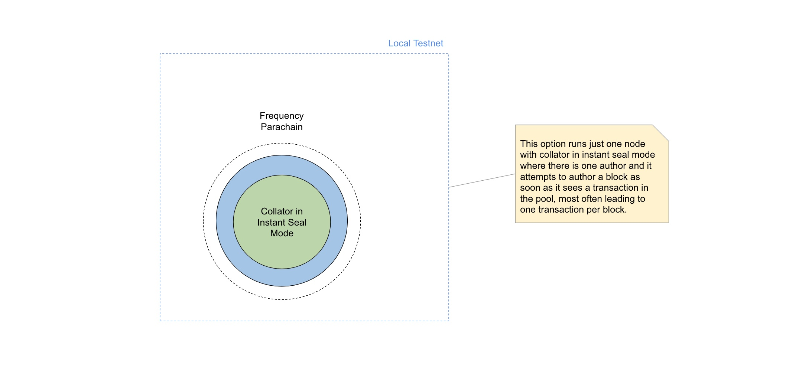

<!-- PROJECT SHIELDS -->
<!--
*** I'm using markdown "reference style" links for readability.
*** Reference links are enclosed in brackets [ ] instead of parentheses ( ).
*** See the bottom of this document for the declaration of the reference variables
*** for contributors-url, forks-url, etc. This is an optional, concise syntax you may use.
*** https://www.markdownguide.org/basic-syntax/#reference-style-links
-->

[![Release][release-shield]][release-url]
[![Docker][docker-shield]][docker-url]
[![Issues][issues-shield]][issues-url]
[![Codecov][codecov-shield]][codecov-url]

Frequency is a [Polkadot](https://www.parity.io/technologies/polkadot) parachain for data distribution protocols such as [DSNP](https://www.dsnp.org).

# Table of Contents

- [Table of Contents](#table-of-contents)
- [Prerequisites](#prerequisites)
  - [Hardware](#hardware)
- [Build](#build)
  - [Local Desktop](#local-desktop)
    - [asdf Support](#asdf-support)
  - [Remote Instance such as AWS EC2](#remote-instance-such-as-aws-ec2)
    - [Ubuntu](#ubuntu)
- [Run](#run)
  - [1. Collator Node without a Relay Chain](#1-collator-node-without-a-relay-chain)
    - [Manual Sealing](#manual-sealing)
    - [Instant Sealing](#instant-sealing)
    - [Interval Sealing](#interval-sealing)
  - [2. Collator Node with Local Relay Chain](#2-collator-node-with-local-relay-chain)
    - [Mixed Terminal/Docker](#mixed-terminaldocker)
      - [Stop and Clean Environment](#stop-and-clean-environment)
    - [All in Docker Container](#all-in-docker-container)
  - [Run Tests](#run-tests)
    - [E2E Tests](#e2e-tests)
  - [Run Benchmarks](#run-benchmarks)
  - [Run with offchain features](#run-with-offchain-features)
- [Format, Lint and Audit Source Code](#format-lint-and-audit-source-code)
- [Runtime](#runtime)
  - [Verify Runtime](#verify-runtime)
  - [Local Runtime Upgrade](#local-runtime-upgrade)
    - [Local Relay Chain](#local-relay-chain)
    - [Standalone Chain (No Relay)](#standalone-chain-no-relay)
- [Contributing](#contributing)
- [Security Issue Reporting](#security-issue-reporting)
- [Additional Resources](#additional-resources)
- [Miscellaneous](#miscellaneous)

# Prerequisites

1. [Docker Engine](https://docs.docker.com/engine/install/)\*
1. [Docker Compose](https://docs.docker.com/compose/install/)

---

- For Mac users, [Docker Desktop](https://docs.docker.com/desktop/mac/install/) engine also installs docker compose environment, so no need to install it separately.

## Hardware

We run benchmarks with and recommend the same [reference hardware specified by Parity for Validators](https://wiki.polkadot.network/docs/maintain-guides-how-to-validate-polkadot#reference-hardware).

# Build

## Local Desktop

1. Install Rust using the [official instructions](https://www.rust-lang.org/tools/install).
2. Check out this repository
3. `rust-toolchain.toml` specifies the standard toolchain to use. If you have `rustup` installed, it will automatically install the correct toolchain when you run any cargo command.
4. Running `make check` will run cargo checks for all Frequency features. This is the recommended way to check your code before committing. Alternatively, you can run following for specific features:

    ```sh
    make check-no-relay
    make check-local
    make check-rococo
    make check-mainnet
    ```

5. Build [Wasm](https://webassembly.org) and native code.

    _Note, if you get errors complaining about missing
    dependencies (protobuf, cmake, yarn, node, jq, etc.) install them with your favorite package
    manager(e.g. [Homebrew](https://brew.sh/) on macOS) and re-run the command again._

    ```sh
    rustup update
    cargo clean
    make build
    ```

    Above will build Frequency with all features. Alternatively you may run following command to build with specific features:

    ```sh
    make build-no-relay
    make build-local
    make build-rococo
    make build-mainnet
    ```

    To build local, rococo (testnet) or mainnet features respectively.

At this point you should have `./target/debug` directory generated locally with compiled project files. (or `./target/release` for `make build-*-release`)

### asdf Support

Frequency optionally supports [asdf](https://asdf-vm.com) for managing dependencies of the following tools:
Install the required plugins for [asdf](https://asdf-vm.com):
Please note that if you use rustup, asdf may conflict and cause issues. It is recommended to use one or the other, but not both for rust.

```sh
asdf plugin-add rust
asdf plugin-add make
asdf plugin-add cmake https://github.com/srivathsanmurali/asdf-cmake.git
```

Install the dependency versions declared in `.tool-versions`

```sh
asdf install
```

NOTE: asdf does not support clang and it needs to be installed separately.

## Remote Instance such as AWS EC2

For remote instances running Linux, if you want to check out and build such as on an [AWS EC2](https://aws.amazon.com/ec2) instance, the process is slightly different to what is in the [Substrate documentation](https://docs.substrate.io/main-docs/install/linux/).

### Ubuntu

1. Upgrade the instance and install missing packages with `apt`:

```bash
sudo apt upgrade
sudo apt upgrade git
sudo apt install —-assume-yes build-essential
sudo apt install --assume-yes clang curl libssl-dev cmake
```

2. Follow [official instructions to install Rust](https://www.rust-lang.org/tools/install), but select `3. customize the installation`, then reply **n** to `Modify PATH variable? (Y/n)`
3. Follow steps 6-10 at [Substrate: Linux development](https://docs.substrate.io/main-docs/install/linux/)
4. Proceed with checking out and building Frequency as above.

# Run

There are 2 options to run the chain locally:

_Note, Running Frequency via following options does not require binary to be built or chain specs to be generated separately, and is programmed within the scripts for simplicity._

1.  Collator Node without a relay chain (in manual/instant/interval sealing mode)
2.  Collator Node with a local relay chain

## 1. Collator Node without a Relay Chain



This option runs just one collator node without the need for a relay chain.

### Manual Sealing
a. Blocks can be triggered by calling the `engine_createBlock` RPC

```sh
curl http://localhost:9944 -H "Content-Type:application/json;charset=utf-8" -d   '{ \
    "jsonrpc":"2.0", \
    "id":1, \
    "method":"engine_createBlock", \
    "params": [true, true] \
    }'
```

b.  Use the "start-manual" make target to call the RPC
Great for testing multiple items in the same block or other block formation tests.

```sh
make start-manual
```

### Instant Sealing

Same as Manual Sealing, but will also automatically trigger the formation of a block whenever a transaction is added to the validated transaction pool.
Great for most testing.

```sh
make start
```

Also available as a Docker image: [`frequencychain/instant-seal-node`](https://hub.docker.com/r/frequencychain/instant-seal-node)

```sh
docker run --rm -p 9944:9944 -p 30333:30333 frequencychain/instant-seal-node
```

To stop running chain hit [Ctrl+C] in terminal where the chain was started.

| **Node**                |             **Ports**             | **Explorer URL**                                                                          |
| ----------------------- | :-------------------------------: | ----------------------------------------------------------------------------------------- |
| Frequency Collator Node | ws and rpc:`9944`, p2p:`3033`     | [127.0.0.1:9944](https://polkadot.js.org/apps/?rpc=ws%3A%2F%2F127.0.0.1%3A9944#/explorer) |


### Interval Sealing

This sealing mode will automatically trigger the formation of a block at a specified interval (default is every 12 seconds.)

```sh
make start-interval
```

## 2. Collator Node with Local Relay Chain


### Mixed Terminal/Docker

This option runs one collator node as local host process and two relay chain validator nodes in each own docker container.

1. Start relay chain validator nodes.

    ```sh
    make start-relay
    ```

1. Register a new parachain slot (parachain id) for Frequency. _Note, if parachain was
   previously registered on a running relay chain and no new registration is required,
   then you can skip the above step._
    ```sh
    make register
    ```

1. Start Frequency as parachain. This step will generate genesis/wasm and start the parachain collator.

    ```sh
    make start-frequency
    ```

1. Onboard Frequency to the relay chain
    ```sh
    make onboard
    ```

#### Stop and Clean Environment

1. Off-board Frequency from relay chain: `make offboard`
2. To stop Frequency running in the terminal: `[Ctrl+C] `
3. Stop the relay chain. `make stop-relay`
4. Run to remove unused volumes. `make docker-prune`
5. Clean up temporary directory to avoid any conflicts with next onboarding:
   `rm -fr /tmp/frequency`

### All in Docker Container

:exclamation: Currently does not work on M\* series MacOS laptops. See https://github.com/LibertyDSNP/frequency/issues/432

Start:

```sh
make start-frequency-docker
```

Stop:

```sh
make stop-frequency-docker
```

| **Node**             | **Ports**                           | **Explorer URL**                                                                          |
| -------------------- | ----------------------------------- | ----------------------------------------------------------------------------------------- |
| Frequency Relay Node | ws and rpc: `9944`, p2p:`30333`     | [127.0.0.1:9944](https://polkadot.js.org/apps/?rpc=ws%3A%2F%2F127.0.0.1%3A9944#/explorer) |
| Alice Relay Node     | ws and rpc: `9946`, p2p:`30335`     | [127.0.0.1:9946](https://polkadot.js.org/apps/?rpc=ws%3A%2F%2F127.0.0.1%3A9946#/explorer) |
| Bob Relay Node       | ws and rpc: `9947`, p2p:`30336`     | [127.0.0.1:9947](https://polkadot.js.org/apps/?rpc=ws%3A%2F%2F127.0.0.1%3A9947#/explorer) |

## Run Tests

```sh
# Run all the tests
make test
# Activate selected features
cargo test --features frequency
```

### E2E Tests

To run the end-to-end tests, run `make e2e-tests`.

## Run Benchmarks

```sh
make benchmarks
```

## Run with offchain features

```sh
make start-frequency-with-offchain
```

# Format, Lint and Audit Source Code

- Format code with `make format` according to style guidelines and configurations in `rustfmt.toml`.
- Lint code with `make lint` to catch common mistakes and improve your [Rust](https://github.com/rust-lang/rust) code.

    _Note, if you get errors complaining about the wasm build, then you may need to install
    the wasm target for rust. You can do this with `rustup target add wasm32-unknown-unknown`

- Alternatively, run `make format-lint` to run both at the same time.
- Run `make lint-audit` to audit `Cargo.lock` files with `cargo-deny` for crates with security vulnerabilities reported to the [RustSec Advisory Database](https://rustsec.org). [See cargo-deny installation instructions](https://github.com/EmbarkStudios/cargo-deny)

# Runtime

## Verify Runtime

1. Check out the commit at which the runtime was built.
2. Use [srtool](https://github.com/paritytech/srtool) and [srtool-cli](https://github.com/chevdor/srtool-cli) to verify the runtime:
    ```sh
    SRTOOL_TAG="1.75.0" srtool build \
            --build-opts="'--features on-chain-release-build,no-metadata-docs,frequency'" \
            --profile=release \
            --package=frequency-runtime \
            --root
    ```

## Local Runtime Upgrade

To upgrade the runtime, run the following command:

### Local Relay Chain
```sh
make upgrade-local
```

### Standalone Chain (No Relay)
```sh
make upgrade-no-relay
```

# Contributing

Interested in contributing?
Wonderful!
Please check out [the information here](./CONTRIBUTING.md).

# Security Issue Reporting

Do you know of an on-chain vulnerability (or possible one) that can lead to economic loss, privacy loss, or instability of the network?
Please report it by following the steps mentioned in [here](./SECURITY.md).

# Additional Resources

- [Cumulus Project](https://github.com/paritytech/cumulus)
- [Cumulus Tutorials](https://docs.substrate.io/tutorials/)
- [Prep Substrate environment for development](https://docs.substrate.io/install/)

# Miscellaneous

```sh
# Clean up local docker resources
make docker-prune

# View all listening ports
lsof -i -P | grep -i "listen"

# View ports Frequency node is listening on
lsof -i -P | grep -i "listen" | grep frequency
```

<!-- MARKDOWN LINKS & IMAGES -->
<!-- https://www.markdownguide.org/basic-syntax/#reference-style-links -->

[issues-shield]: https://img.shields.io/github/issues/LibertyDSNP/frequency.svg?style=for-the-badge
[issues-url]: https://github.com/LibertyDSNP/frequency/issues
[codecov-shield]: https://img.shields.io/codecov/c/github/LibertyDSNP/frequency?style=for-the-badge
[codecov-url]: https://app.codecov.io/gh/LibertyDSNP/frequency
[release-shield]: https://img.shields.io/github/v/release/LibertyDSNP/frequency?style=for-the-badge
[release-url]: https://github.com/LibertyDSNP/frequency/releases
[docker-shield]: https://img.shields.io/docker/v/frequencychain/parachain-node-mainnet/latest?color=1c90ed&label=Docker&style=for-the-badge
[docker-url]: https://hub.docker.com/u/frequencychain
