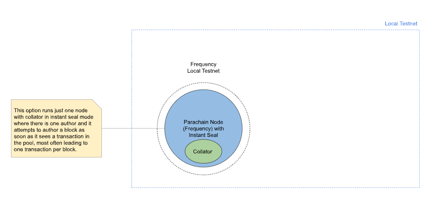
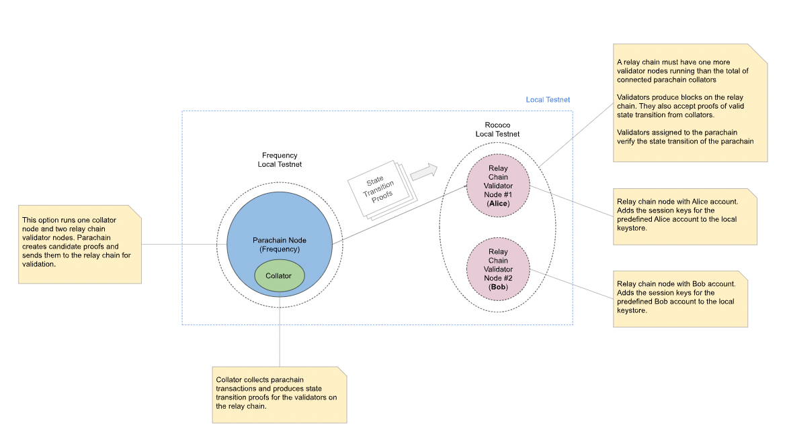

Frequency is a Polkadot parachain designed to run Decentralized Social Network Protocol
(DSNP), but it could run other things.

# Prerequisites

1. [Docker Engine](https://docs.docker.com/engine/install/)*
1. [Docker Compose](https://docs.docker.com/compose/install/)


---
* For Mac users, [Docker Desktop](https://docs.docker.com/desktop/mac/install/) engine also installs docker compose environment, so no need to install it separately.

# Build

## Local desktop
1. Install Rust using the [official instructions](https://www.rust-lang.org/tools/install).
1. Initialize your Wasm Build environment.
   ```sh
   cd [path/to/repo/root]
   ./scripts/init.sh install-toolchain
   ```
1. Build Wasm and native code. *Note, if you get errors complaining about missing
dependencies (cmake, yarn, node, jq, etc.) install them with your favorite package
manager(e.g. Homebrew on Mac) and re-run the command again.*
   ```sh
   cargo build --release
   ```
   Alternatively you may run `TARGET=build-node ./ci/build.sh`

At this point you should have `./target/release` directory generated locally with compiled
project files.

## Remote instance such as AWS EC2
For remote instances running Linux, if you want to check out and build such as on an AWS EC2 instance, the process is slightly different to what is in the Substrate documents.
### Ubuntu
1. Upgrade the instance and install missing packages with `apt`:
```bash
sudo apt upgrade
sudo apt upgrade git
sudo apt install —assume-yes build-essential
sudo apt install --assume-yes clang curl libssl-dev cmake
```
2. Follow [official instructions to install rust](https://www.rust-lang.org/tools/install), but select `3. customize the installation`, then reply **n** to `Modify PATH variable? (Y/n)`
3. Follow steps 6-10 at [Substrate: Linux development](https://docs.substrate.io/main-docs/install/linux/)

4. Proceed with checking out and building frequency as above.

# Run

There are 2 options to run the chain locally:

## (Option 1) Local Testnet with Instant Sealing



This option runs just one collator node in instant seal mode and nothing more.
A "collator node" is a Frequency parachain node that is actively collating (aka forming blocks to submit to the relay chain). The instant seal mode allows a blockchain node to author a block
as soon as it goes into a queue. This is also a great option to run with an example client.

Start chain in instant sealing mode
```sh
make start
```

To stop running chain hit [Ctrl+C] in terminal where the chain was started.

| **Host** | **Ports** | **Dashboard URL** |
| ---- | ---- | --- |
| Frequency Collator Node | ws:`9944`, rpc`:9933`, p2p:`3033` | [127.0.0.1:9944](https://polkadot.js.org/apps/?rpc=ws%3A%2F%2F127.0.0.1%3A9944#/explorer) |


## (Option 2) Local Testnet with One Collator and Relay Chain Nodes



This option runs one collator node and two relay chain validator nodes. The validator
nodes are run locally in docker, but could be any other relay chain like the
devnet relay chain.

1. Start relay chain validator nodes.
   ```sh
   make start-relay
   ```

1. Register a new parachain slot (parachain id) for Frequency. *Note, if parachain was
previously registered on a running relay chain and no new registration is required,
then you can skip the above step.*
   ```sh
   make register
   ```
1. Generate chain spec files. If this is your first time running the project or
new pallets/runtime code changes have been made to Frequency, then the chain specs
need to be generated. Refer to [generation spec file](#generate-a-new-spec-file)
for more details.

1. Start Frequency as parachain. This step will generate genesis/wasm and onboard the
parachain.
   ```sh
   make start-frequency
   ```

1. Onboard Frequency to the relay chain
   ```sh
   make onboard
   ```

| **Host** | **Ports** | **Dashboard URL** |
| ---- | ----- | ------------ |
| Frequency Relay Node | ws:`9944`, rpc`:9933`, p2p:`30333` | [127.0.0.1:9944](https://polkadot.js.org/apps/?rpc=ws%3A%2F%2F127.0.0.1%3A9944#/explorer) |
| Alice Relay Node | ws:`:9946`, rpc`:9935`, p2p:`30335` | [127.0.0.1:9946](https://polkadot.js.org/apps/?rpc=ws%3A%2F%2F127.0.0.1%3A9946#/explorer) |
| Bob Relay Node | ws:`:9947`, rpc`:9936`, p2p:`30336` | [127.0.0.1:9947](https://polkadot.js.org/apps/?rpc=ws%3A%2F%2F127.0.0.1%3A9947#/explorer) |

## Stop and Clean Environment

1. Off-board Frequency from relay chain.
   ```sh
   make offboard
   ```
1. [Ctrl+C] to stop Frequency running in the terminal.
1. Stop the relay chain.
   ```bash
   make stop-relay
   ```
1. Run to remove unused volumes.
   ```sh
   docker volume prune
   ```
1. Clean up temporary directory to avoid any conflicts with next onboarding
   ```sh
   rm -fr /tmp/frequency
   ```

## Run Tests

To execute unit and integration tests run the following:

```sh
# Activate selected features
cargo test --features runtime-benchmarks, std
# Activate all features and test all packages in the workspace
cargo test --all-features --workspace --release
```

## Generate a New Spec File

To build spec against specific chain config specify chain name in the command above.

1. Update `node/**/chain_spec.rs` with required spec config, defaults to `para_id:2000`
and relay chain to be `rococo_local.json` with `protocol_id:frequency-local`
1. Export the chain spec
   ```sh
   cargo run --release build-spec --disable-default-bootnode > ./res/genesis/local/frequency-spec-rococo.json
   ```
1. Export the raw chain spec
   ```sh
   cargo run --release build-spec --raw --disable-default-bootnode --chain ./res/genesis/local/frequency-spec-rococo.json > ./res/genesis/local/rococo-local-frequency-2000-raw.json
   ```

Alternatively, run the following to generate plain and raw frequency spec along with
genesis state and WASM:

- `make specs-rococo-2000` for Rococo local testnet
- `make specs-rococo-4044` for Rococo public testnet

# Format and Lint

- Format code with `make format`  according to style guidelines and configurations
in `rustfmt.toml`.
- Lint code with with `make lint` to catch common mistakes and improve your
[Rust](https://github.com/rust-lang/rust) code.
- Alternatively, run `make format-lint` to run both at the same time.

# Verify Runtime

1. Check out the commit at which the runtime was built.
2. Use srtool to verify the runtime:
   ```sh
   TARGET=build-runtime RUST_TOOLCHAIN=nightly ./ci/build.sh
   ```

# Runtime Upgrade

1. Runtime upgrade enables upgrading running chain to a new runtime.
2. To upgrade the runtime, current scripts does following step process:
   1. Build new runtime and generate the compressed wasm
   2. Call ```authorizeUpgrade``` extrinsic from parachain system to initate the upgrade.
   3. Call ```enactAuthorizedUpgrade``` extrinsic from parachain system to enact the upgrade.
   4. For testnet and mainnet, the upgrade is done slightly differently using ```scheduler``` and enactment is scheduled for a specific block number in the future.
3. To upgrade the runtime, run the following command:
   ```sh
   make upgrade-local
   ```

# Contributing

Interested in contributing?
Wonderful!
Please check out [the information here](./CONTRIBUTING.md).

# Additional Resources
- [Cumulus Project](https://github.com/paritytech/cumulus)
- [Cumulus Tutorials](https://docs.substrate.io/tutorials/)
- (more to come...)

# Misc

## Run Frequency in Docker Container
There is an alternative way to start Frequency in a docker container
(:exclamation: currently works on Linux only):
```sh
# Start Frequency in docker
cargo build --release
make start-frequency-docker

# Stop Frequency in docker
make stop-frequency-docker
```

## Helpers
```sh
# View all listening ports
lsof -i -P | grep -i "listen"

# View ports Frequency node is listening on
lsof -i -P | grep -i "listen" | grep frequency
```
