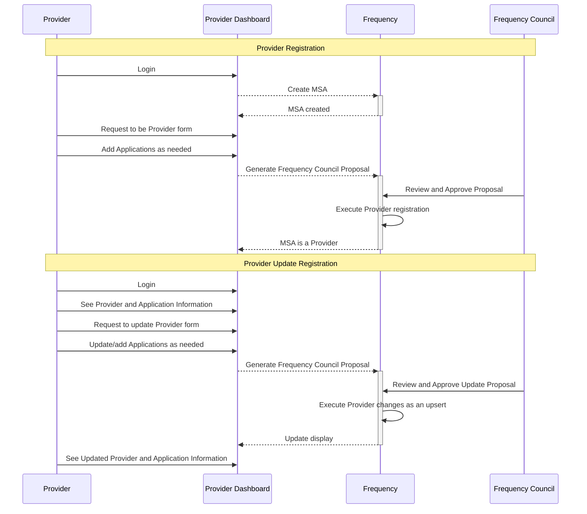

# Provider Contexts Design Doc

## Context and Scope

On Frequency, a Provider may either represent an application or a company.
This document will outline the changes that will allow a Provider to represent a company with one or multiple applications.
It also enables social wallet providers, custodial and non-custodial, to provide safe application information to their users.

This is an expansion of the [Registered Provider](https://github.com/frequency-chain/frequency/blob/main/designdocs/provider_registration.md) concepts.

Reference Document: [SIWF Specification](https://projectlibertylabs.github.io/siwf/v2/docs/)

### Why Is This Needed?

#### Concept of an Application Separate from a Provider

Many companies have a single major product, but some companies have multiple applications that serve different needs.
While each application could be a separate provider, this causes two issues: The sharing of capacity and the user permissions.

Having separate providers would require a single company to have separate Capacity staking for each application.
Since these applications are part of the same company, they should share Capacity as a single legal entity.

Separate providers per application would NOT align with the data security model of user-to-company that exists in the world today, in which users form trust relationships with legal entities (companies) rather than each individual application.
For example, imagine if Alice is delegating to an application, Bar. Bar application is owned by the Foo Company which also owns and controls Baz. The Foo Company is able to collect all data shared with both the Bar and the Baz. A delegation to just Bar or just Baz doesn't limit the information sharing between those Applications because the data agreement is with Foo Company.
Additionally, to limit the impact on the network, the Bar and Baz Applications are able to share capacity and perform batching together.
This leads to the conclusion that Provider-level delegations are better than introducing new Application-level delegations.
While user permissions are primarily write-based at this time, it is critical that users understand the delegation and their data is shared at a company level.

Finally, this structure does not prevent the setup of a 1:1 relationship between Application and Provider.
If a company wishes, they can create more than one Provider for the purposes of separation.
This may be desirable if there is a subsidiary company or other complex structures.

#### User Trust in Application Presentation

Users need to know what application they are logging into and trust that the displayed information is not a phishing attack.
Users have a reasonable expectation that the chain and wallet provide a level of protection against phishing attacks from Providers and Applications.

#### Easy Wallet Integration of Data

Wallets displaying login request information need to be able to easily obtain and verify the information they want to show the user.

## Proposal

Frequency should provide a safeguarded system of setting and updating Provider and Provider Application Contexts for wallets to display to users.

- [Storage and Structure of the Data](#data)
- [Changes and additions in extrinsics](#extrinsics)
- [Storage Migration](#migration)
- [Mainnet Approval Flow](#governance)
- [Example of Wallet Usage via SIWF](#siwf)
- [Provider Dashboard Steps](#dashboard)

### **Storage and Structure of the Data** <a id='data'></a>

Currently, the `ProviderRegistryEntry` has only a `name` property, and no way to update said name.

Applications have two different pieces of default and (potentially) internationalized data:

- name
- logo/image

Limits:

1. Provide a space to internationalize up to 150 localizations (Windows and macOS each have < 150).
2. Image MUST BE encoded (`png`)[https://www.w3.org/TR/png-3/] that is `250x100` (support for future sizes and light/dark should be considered).
3. Localization keys should follow BCP 47 format like en-US, fr-FR.

The data structure must support both of these and internationalization.

Proposed are the following changes:

1. Update `ProviderRegistryEntry`.

    Each registry entry supports:
    - A default name and logo (hash of the logo image).
    - Localized names and logos (up to 150 locales).
    - PNG logo support (250x100, up to 128 KiB). Note that the logo is not embedded in the proposal but rather a hash of the logo image.
    - BCP 47-compliant language codes (e.g., en-US, fr-FR).
2. Updated `ProviderRegistryEntry` struct have the following properties:

    ```rust
    type LogoHash = [u8; 32]; // blake2_256 hash of the logo
    pub struct ProviderRegistryEntry<T: Config> {
        pub default_name: BoundedVec<u8, T::MaxProviderNameSize>,
        pub localized_names: BTreeMap<BoundedVec<u8, T::MaxLanguageCodeSize>, BoundedVec<u8, T::MaxProviderNameSize>>,
        pub default_logo_250_100_png_hash: LogoHash,
        pub localized_logo_250_100_png_hashes: BTreeMap<BoundedVec<u8, T::MaxLanguageCodeSize>, LogoHash>,
    }
    ```

3. New `ProviderToApplicationRegistryEntry` storage be initialized:

    ```rust
    // Alias for clarity
    pub type ApplicationIndex = u16;

    #[pallet::storage]
    pub type ProviderToApplicationRegistryEntry<T: Config> = StorageDoubleMap<
        _,
        Twox64Concat,
        ProviderId,
        Twox64Concat,
        ApplicationIndex,
        ProviderRegistryEntry<T>,
        OptionQuery,
    >;
    ```

4. `MaxProviderNameSize` be increased to `256`.
5. `MaxProviderLogo250X100Size` be created and the limit set to `131_072` (128 KiB).
6. Introduce hash-based logo approval mechanism:
    Logos are not embedded during proposal submission. Instead, a blake2_256 hash of the logo image is included in the proposal.
    Governance must explicitly approve these logo hashes as part of the provider registration process.

    The approved hashes are recorded in a dedicated storage map:

    ```rust
        #[pallet::storage]
        #[pallet::getter(fn approved_logo_hashes)]
        /// Approved logo hashes for providers.
        /// This map stores the blake2_256 hash of the logo as the key and an empty tuple as the value.
        pub ApprovedLogoHashes: StorageMap<
            _,
            Blake2_128Concat,
            LogoHash,
            (),
            OptionQuery
        >;

        /// ApprovedLogos is map of hash vs logo bytes.
        /// This is used to store the approved logos for providers.
        /// The key is the blake2_256 hash of the logo image, and the value is the actual logo bytes.
        /// This allows for easy retrieval of the logo by its hash
        #[pallet:storage]
        #[pallet::getter(fn approved_logos)]
        pub ApprovedLogos: StorageMap<
            _,
            Blake2_128Concat,
            LogoHash,
            BoundedVec<u8, T::MaxProviderLogo250X100Size>,
            OptionQuery
        >;

    ```

    The `propose_to_be_provider` extrinsic will insert or update entries in this map.

### **Changes and additions in extrinsics** <a id='extrinsics'></a>

1. The `propose_to_be_provider` extrinsic will now accept an optional list of hashes for images/logos to be approved by governance.

    ```rust

        #[pallet::call_index(0)]
        pub fn propose_to_be_provider(
            origin: OriginFor<T>,
            payload: ProviderRegistryEntry<T>,
        ) -> DispatchResultWithPostInfo {
            // Implementation details...
        }
    ```

2. `propose_to_be_provider` to will insert hashes into the `ApprovedLogoHashes` storage map.
3. Introduce a new extrinsic `propose_to_add_application` which work in similar way to `propose_to_be_provider` but will be used for adding or updating application contexts.

    ```rust
        #[pallet::call_index(1)]
        pub fn propose_to_add_application(
            origin: OriginFor<T>,
            payload: ProviderRegistryEntry<T>,
        ) -> DispatchResultWithPostInfo {
            // Implementation details...
            // This can internally call same logic as `propose_to_be_provider` for consistency
            // and will also handle the `ProviderToApplicationRegistryEntry` storage map.
            // It will also handle the `ApprovedLogoHashes` storage map.
        }
    ```

    Note:
    - The same extrinsic should be able to used to proposing new image/logo hashes when an existing application context needs to be updated.
4. `propose_to_add_application` will insert or update the `ProviderToApplicationRegistryEntry` with the current (numeric) `ApplicationIndex` and `ProviderRegistryEntry`.

    ```rust
        // Example of how the entry might look like
        let application_entry = ProviderRegistryEntry {
            default_name: application_name,
            localized_names: BTreeMap::new(), // Initially empty, can be updated later
            default_logo_250_100_png_bytes: BoundedVec::default(), // Initially empty, can be updated later
            localized_logo_250_100_png_bytes: BTreeMap::new(), // Initially empty, can be updated later
        };

        ProviderToApplicationRegistryEntry::<T>::insert(provider_id, application_identifier, application_entry);
    ```

5. `propose_to_add_application` will also insert the logo hashes into the `ApprovedLogoHashes` storage map.
6. Introduce a new extrinsic to `update_logo` for updating `ApprovedLogos` map (post goveranance registration) provided with logo bytes.

    ```rust
        #[pallet::call_index(14)]
        pub fn update_logo(
            origin: OriginFor<T>,
            logo_bytes: BoundedVec<u8, T::MaxProviderLogo250X100Size>,
        ) -> DispatchResultWithPostInfo {
            // Store the logo bytes in ApprovedLogos
        }
    ```

    Note: This extrinsics will compute the logo hash and update the `ApprovedLogos` storage map if the hash exists in `ApprovedLogoHashes`.
7. Ensure that application updates would require governance approval, hence `propose_to_add_application` will be used for both adding and updating applications.

### **Storage Migration** <a id='migration'></a>

To support the new structure, a storage migration will be required to:

- Migrate existing `ProviderToRegistryEntry` to the new format with default values for localized names and logos.

### **Runtime RPC Changes** <a id='rpc'></a>

1. Introduce a new RPC method "get_provider_application_context" to fetch the application context for a given provider and application index.

    ```rust
    // Return a constructed ApplicationContext struct
    // This struct will contain the default name, localized names, default logo, and localized logos.
    #[derive(Encode, Decode, Clone, PartialEq, Eq, Debug)]
    pub struct ApplicationContext<T:Config> {
        pub default_name: BoundedVec<u8, T::MaxProviderNameSize>,
        pub localized_names: BTreeMap<BoundedVec<u8, T::MaxLanguageCodeSize>, BoundedVec<u8, T::MaxProviderNameSize>>,
        pub default_logo_250_100_png: BoundedVec<u8, T::MaxProviderLogo250X100Size>,
        pub localized_logo_250_100_png: BTreeMap<BoundedVec<u8, T::MaxLanguageCodeSize>, BoundedVec<u8, T::MaxProviderLogo250X100Size>>,
    }

    // The rpc should fetch the data from `ProviderToApplicationRegistryEntry` and construct the ApplicationContext with logos from `ApprovedLogos`.
    #[rpc]
    pub fn get_provider_application_context(
        provider_id: ProviderId,
        application_index: ApplicationIndex,
    ) -> Option<ApplicationContext<T>>;
    ```

2. Optionally, introduce "get_provider" RPC method to include the new fields for localized names and logos and return a provider registry entry.

    ```rust
    #[rpc]
    pub fn get_provider(
        provider_id: ProviderId,
    ) -> Option<ApplicationContext<T>>;
    ```

### **Optional TransactionExtension** <a id='transaction_extension'></a>

1. Given the new structure, it may be beneficial to introduce a transaction extension that checks for logo hashes in the `ApprovedLogoHashes` storage map before allowing a transaction to proceed for `update_logo`.

### **Mainnet Approval Flow** <a id='governance'></a>

_Any_ change to the Provider or Application Context must be approved by governance.
For now, that governance approval is any single Frequency Council member.



#### Open Questions

- Is this a set or edit pattern for the applications?
- Should adding/updating applications be a separate call?
- Should adding/updating a translation be a separate call?

#### Implementation Suggestion

To limit the amount of unapproved bytes intended to be interpreted as images on chain, an option would be to merely submit the hashes of images for approval.
This hash would then be allowlisted for that provider.
Once approved, that provider could submit the image to chain.
In the governance process, a link to the image would need to be submitted.

### **Example of Wallet Usage via SIWF** <a id='siwf'></a>

SIWF [Signed Request Payload](https://projectlibertylabs.github.io/siwf/v2/docs/DataStructures/All.html) can expand the optional `applicationContext` value with a new optional `id` field that is the text of the `ApplicationIndex` on chain.
This would allow a smooth transition between `applicationContext.url` and `applicationContext.id` with both being optional.

The Wallet would then:

1. Verify the SIWF Signed Request.
2. Lookup the Provider via the `publicKey` in the SIWF Signed Request.
3. If any, fetch the `ApplicationIndex` from Frequency.
4. If present, fetch the `ProviderToApplicationRegistryEntry` for that (ProviderId, ApplicationId) pair. Otherwise, fetch the default `ProviderToRegistryEntry` for the ProviderId
5. Display the information to the user to help them know who they are authorizing.
6. Allow the user to continue the login process.

### **Provider Dashboard Steps** <a id='dashboard'></a>

Provider Dashboard needs to be able to:

- Create a provider without any application context other than the default provider context
- Update the default provider context, logos, and translations
- Add new Application Contexts with a identifier (unique to that provider), logos, and translations
- Remove an existing Application Context
- Update an Application Contexts with new logos, and translations

## Non-goals

- Implementation of verified credentials for applications (Aka FooBar is approved by <Consumer Org>)
- Providing for independent body to perform verification

## Benefits and Risk

### Benefit: User protection and Application diversity

Users will have a greater confidence when they are logging into an application that the application is represented honestly, even with the continuous risk of trusting any new application with user data.

### Risk: Initial structure of only one Frequency Council member approving changes in an application

Tricking a single member is much simpler than a more detailed vetting process; however, at this stage, the number of providers is small.

This process should be re-evaluated as the number of Providers grows.

### Risk: Logo Images on Chain

This provides a direct way to place image content on chain, intended to be interpreted as image content.
While this must still pass through the governance step to be used by others via the content the image would still be in the chain history as there is always a risk of problematic images being proposed.
This risk is mitigated by:

- A registered provider must be taking the action
- Larger images require larger token fees to cover the cost
- IF applied, the suggested hash requirement for the image upload could remove this issue entirely

The mitigation is enough for the benefit of clear branding for users to outweigh this risk.

## Alternatives and Rationale

1. Trusted Domains
2. Off-chain authentication and verification

### Verify and Just Trust a Domain

While using the domain name system for verification is fine, the issue remains that a malicious Provider could still portray themselves as another application via a Phishing attack.
The desired trust is that the Provider is not maliciously presenting themselves, not that the domain is correct according to the user which would prevent phishing.

Example phishing attack: Foobar.co could represent themselves as Foobar.com and display the logo of Foobar.com from `https://foobar.co/images/logo.png`.

### Off-chain Authentication and Verification

The wallet interface could also (via some mechanism) reach out for the verification or have an allowlist of verified providers.

However, this either requires a centralized service or a patchwork of verifications.
Self-verification is not possible due to the phishing attack.
There is a coordination service of Frequency, but using a schema or other non-verified setup would still require reaching out and extending trust to some other 3rd-party or patchwork verification system.

In the end this solution results in these two problems:

- 3rd-party patchwork systems increase friction and complexity.
- External centralization is undesirable.

There is a future where 3rd-party verification can be used in conjunction with on-chain approval.
