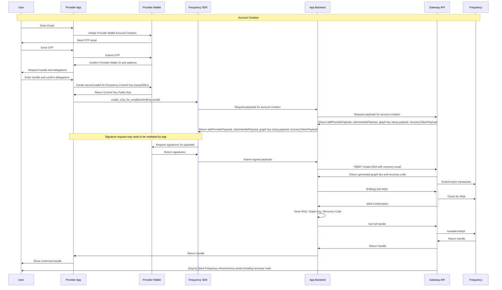
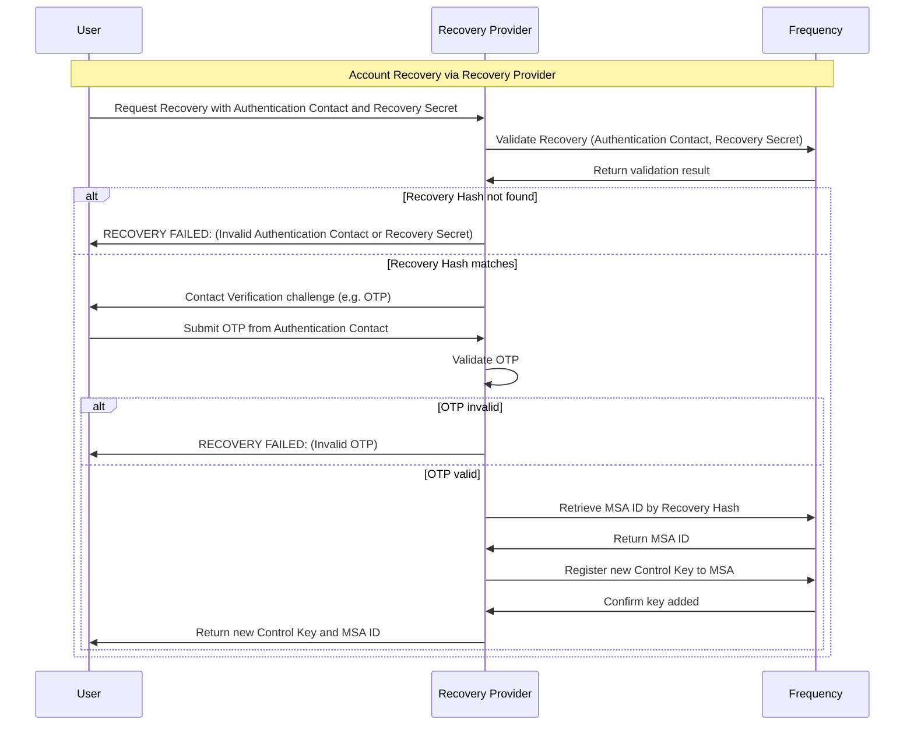

# Secure Account Recovery System Design for Frequency MSA

## Context and Scope

When a Frequency blockchain user’s wallet provider becomes unavailable, recovering control of their on-chain identity (Message Source Account, MSA) is critical. This document designs a secure account recovery system that lets users regain access to their MSA ID through governance-approved recovery providers. It outlines the cryptographic scheme, end-to-end workflows, security rationale, and implementation considerations. The goal is a robust recovery process that preserves decentralization and user security, even if the original wallet or provider is lost.

## Key Requirements

### Functional Requirements

1. Recovery Secret Generation: On MSA creation, the wallet provider collects the user’s preferred contact method and generates a Recovery Secret using a reversible combination of the email with a random salt/seed (e.g. a BIP-39 seed phrase). The resulting key (or a cryptographic derivative) is securely stored on-chain (encrypted or hashed) to allow future recovery.

2. Single Active Key: A maximum of one Recovery Secret exists per user at any time. If a Recovery Secret is ever used (consumed) during account recovery, it is invalidated on-chain. The user or new provider may then issue a new Recovery Secret for future use, but duplicate or old keys cannot remain active simultaneously.

3. Governance-Approved Providers: Recovery operations are performed by special Recovery Providers that are approved via on-chain governance (listed in a registry). When a user needs account recovery, they contact one of these providers trusted to do the Contact Verification and submit their Recovery Secret along with their Authentication Contact information.

4. Validation by Provider: The recovery provider must validate two things off-chain: (a) the submitted Recovery Secret (in combination with the Authentication Contact information) matches the on-chain record for some MSA ID (proving the key is valid for that account), and (b) the provided Authentication Contact is truly controlled by the user (e.g. via a secure email verification challenge). Only if both checks pass is recovery authorized.

5. On-Chain Key Addition: After successful validation, the Recovery Provider accepts or generates a new Control Key for the user (typically a new key pair) and uses a blockchain transaction to associate this new Control Key with the user’s MSA ID on-chain. This effectively restores user control. The old compromised or inaccessible key can be removed or left unused; the new key will have full control of the MSA.

6. User Notification: Finally, the provider delivers the MSA ID (if the user doesn’t know it) and the new Control Key credentials, or provider approved login credentials to the user through a secure channel. The user can now access their MSA with the new Control Key going forward.

### Security Requirements

1. High Entropy & Cryptographic Strength: The Recovery Secret generation scheme must provide sufficient entropy and cryptographic strength to resist guessing or brute-force attacks. The one-way hash (Recovery Secret + Authentication Contact) should yield an unpredictable secret with at least 128-bit security.

2. Secure Authentication Verification: The authentication step must be implemented securely to avoid vulnerabilities. The system should ensure that possession of the Authentication Contact account is verified via robust methods (e.g. time-bound one-time (OTP) codes or magic links) without exposing the Recovery Secret or other secrets. No sensitive data is sent via email; only random verification tokens are.

3. Brute Force Resistance: Recovery Hashes (as stored on-chain) must be resistant to brute force and offline attacks. An attacker who obtains the on-chain hash should not be able to feasibly crack it to derive the Authentication Contact or Recovery Secret. The design should incorporate strong cryptographic hashing or encryption to protect against precomputation and exhaustive search.

The following sections detail the cryptographic design meeting these requirements, the recovery workflows (with sequence diagrams), security analysis, and an example implementation snippet.

## Glossary of Terms

- **MSA**: Message Source Account, the user’s on-chain identity.
- **Control Key**: The cryptographic key that allows the user to control their MSA. It is used for signing transactions and messages on the Frequency blockchain.
- **Recovery Secret**: A 32 byte hexadecimal secret derived from the user’s Authentication Contact and a random seed, used to recover access to the MSA.
- **Recovery Provider**: A third-party service approved by Frequency governance to perform account recovery operations.
- **Recovery Hash**: A cryptographic hash derived from the Recovery Secret and Authentication Contact, stored on-chain to allow recovery.
- **Control Key**: A cryptographic key that allows the user to control their MSA. It can be a public key used for signing transactions or messages on the Frequency blockchain.
- **Governance**: The on-chain mechanism that approves and manages recovery providers, ensuring they follow the protocol rules and security standards.
- **Authentication Contact**: The user’s chosen method for receiving recovery-related communications, typically an email address or phone number.
- **Contact Verification**: The process of confirming the user’s Authentication Contact method (email or phone) for recovery communications.

## Cryptographic Design & Rationale

### Recovery Secret Composition

Each user’s Recovery Secret is derived from a combination of their Authentication Contact and a random secret. This design proposes using a 32 byte random hexadecimal value as the random secret component due to creating high entropy and user-friendliness.

### Key Generation (Authentication Contact + Salt/Seed)

The blockchain combines the user’s Authentication Contact with a random seed in a reversible but secure way.
Two design options were considered:

- Option A: Deterministic Hash (One-Way): Compute a cryptographic hash
  - H(s) = keccak256(Recovery Secret)
  - H(c) = keccak256(Authentication Contact)
  - RH = keccak256( H(s) + H(s + c)) and store RH on-chain.

   In this scheme, reversibility means that given the correct Authentication Contact and Recovery Secret, one can recompute RH (Recovery Hash) and match the on-chain value – thus verifying the combination. This is effectively a commitment to the Authentication Contact + Recovery Secret. The user’s Recovery Secret is not stored on-chain, only the Recovery Hash, so it cannot be directly recovered by anyone. The hash approach is simple: any Recovery Provider can later hash the user’s provided Authentication Contact + Recovery Seed and check against the on-chain record for a match.

   Note: The Authentication Contact is typically the user’s email address, but could also be a phone number or other identifier. The hash ensures that even if the Authentication Contact is known, the Recovery Secret remains secure. The Authentication Contact must be normalized (e.g. lowercased for emails) before hashing to ensure consistent results.

- Option B: Encryption (Two-Way): Derive an encryption key from the email and seed, and use it to encrypt a known plaintext (such as the user’s MSA ID or a fixed marker). For example, derive a symmetric key K = PBKDF2(email || seed, salt=networkSalt, iter=100k) and use AES-256 to encrypt the user’s MSA ID. Store the ciphertext on-chain. In the future, a recovery provider who is given the correct email and seed can derive K and decrypt the blob to retrieve the MSA ID (achieving “reversibility” by decryption). This approach hides the MSA ID and requires possession of the seed to decrypt. It effectively binds the MSA ID to the secret.

Option A (hash-based) is favored for simplicity and on-chain verification capability. Hashing the recovery data means the chain can later verify a recovery attempt by recomputing a hash, without needing to store any encryption keys. Hash storage is also aligned with security best practices. The only data needed for recovery is a successful hash match, rather than extracting plaintext.

### Hash Algorithm and Salting

This design uses a keccak256 hash function for the Recovery Hash (RH) due to its widespread use in blockchain applications and its security properties. The hash is computed as follows:

```rust
// Pseudocode for computing the Recovery Hash
// The function accepts the hash(recovery secret), and the hash(authentication contact + recovery secret)
fn compute_recovery_hash(hash_recovery_secret: [u8; 32], hash_contact_secret: [u8; 32]) -> [u8; 32] {
    let mut hasher = Keccak256::new();
    hasher.update(hash_recovery_secret);
    hasher.update(hash_contact_secret);
    hasher.finalize().into()
}
```

### On-Chain Storage

The resulting Recovery Hash (RH) is stored in the Frequency blockchain’s state, associated with the user’s MSA ID. This could be in a dedicated Recovery Secret Registry mapping MSA ID -> recovery_hash. Only the hashed/encrypted form is stored – the plaintext Authentication Contact or Recovery Secret are never exposed on-chain, preserving privacy. Even if an attacker scans the chain state, they see only a random 256-bit value per account, not an email or any directly usable key.

### Recovery Secret Distribution to User

After generation, the hexadecimal Recovery Secret is given to the user to hold. The provider must instruct the user to safely back up this Recovery Secret, similar to how one would back up a wallet mnemonic. This design seeks to ensure that possession of the Recovery Secret is limited to the user (something they have), complementing the Contact Verification (something they control). This two-factor approach is still secure if the Recovery Secret is sent via email, as long as the Contact Verification step is robust.

### Entropy and Security

By using a cryptographically secure random secret of 256 bits, we ensure the Recovery Secret cannot be guessed or enumerated by attackers. A 256-bit key has 2^256 possibilities, which is beyond computational reach. In practice, 128-bit is considered secure for the foreseeable future, meeting [NIST’s](https://nvlpubs.nist.gov/nistpubs/SpecialPublications/NIST.SP.800-131Ar2.pdf]) recommended minimum of ~112-bit security strength for new systems, and aligning with 128-bit standards for encryption and hashing going forward. This high entropy addresses the security requirement for brute force resistance.

### One-time Use & Rotation

The on-chain design allows single-use Recovery Secrets. The chain will enforce that only one Recovery Secret entry exists per MSA. If a Recovery Secret is ever used in the recovery process, the act of recovery will trigger its invalidation (removal). To implement this, the recovery extrinsic (described later) will clear the stored hash. This prevents re-play: an attacker can’t re-use an old Recovery Secret to perform a second recovery on the same account. If the user wants to regain a recovery option after using it, they (with their newly recovered access) can register a fresh Recovery Secret with a provider. This fulfills the requirement that “the previous recovery code becomes invalid” after use.

## System Workflow

### 1. Account Creation & Recovery Secret Issuance

When a user first creates an account (MSA) through a wallet provider, the provider will ask the blockchain to generate and register a Recovery Secret for that user as part of the setup. The sequence diagram below illustrates this process:



#### Sequence diagram – Account creation and Recovery Secret setup

1. User Account Creation: The user signs up with a wallet/app (the provider) and provides their email address as part of registration. The provider creates a new MSA on the Frequency blockchain for the user. During this on-chain account creation, the user’s initial control key (public key) is linked to the MSA (this may be a key managed by the provider).

2. Recovery Secret Generation: The blockchain generates a random secret (e.g. a 256-bit entropy value). It will call a secure random generator to get 32 bytes and then encode as a hexadecimal phrase.

3. On-Chain Storage: The blockchain stores the Recovery Hash (RH) using the extrinsic, `add_recovery_hash`, as part of the MSA creation process. The blockchain will store RH in association with that MSA ID.

4. User Receives Recovery Secret: Once the MSA is successfully created and the Recovery Hash stored, the provider delivers the actual Recovery Secret to the user.

5. After account creation, the chain holds: (a) the user’s MSA ID and control key, and (b) the Recovery Hash (bound to that MSA). The user holds: (a) their Authentication Contact, and (b) the Recovery Secret. The blockchain and provider may discard the Recovery Secret (it’s not needed by the provider anymore), keeping only the hash on-chain. The user’s responsibility is to keep the Recovery Secret safe and not share it.

### 2. Account Recovery Process

If the original wallet provider becomes unavailable or the user loses access to their account keys, the user can invoke the recovery process with a governance-approved recovery provider. The sequence is as follows:



#### Sequence diagram – Account recovery via a recovery provider

#### 1. Initiating Recovery

The user contacts a Recovery Provider (a third-party service listed on-chain as authorized for recoveries). This could be through a web portal or app provided by that entity. The user supplies two things to the provider:

- Their Authentication Contact (the one they used at account creation).
- Their Recovery Secret (the secret phrase they saved).

The Recovery Provider likely presents a form for the user to input these. At this point, the provider does not yet know the user’s MSA ID or whether the data is valid – that will be determined next.

#### 2. On-Chain Validation (Recovery Secret)

The recovery provider uses the submitted Authentication Contact + Recovery Secret to validate against the blockchain:

- It submits the recovery data to the blockchain and determine if any MSA record has a matching Recovery Hash. This can be done via an extrinsic `verify_recover_secret(hash_auth_contact, hash_contact_secret)` as the hash is computed on-chain.
- If no match is found, the Recovery Provider knows the provided secret is invalid (or not current). Recovery is refused in that case (the Recovery Provider will inform the user that the key or Authentication Contact is incorrect).
- If a match is found, the Recovery Provider obtains the MSA ID associated with that Recovery Hash. Let’s call this `target_msa`.

In this design, this check does not require any secret information from the chain; it’s a public data lookup combined with the user-supplied secret. Only a genuine user with the correct secret could produce a hash that matches an on-chain entry, due to the one-way property of the hash.

#### 3. Off-Chain Validation (Authentication Contact Ownership)

Before proceeding, the Recovery Provider must ensure the person requesting recovery controls the Authentication Contact on file. This mitigates attacks where someone finds a lost recovery phrase but doesn’t own the Authentication Contact, for example. The Recovery Provider performs an Authentication Contact challenge:

- The Recovery Provider generates a one-time random verification code (e.g. a 6-8 digit numeric code or a secure random token) and sends it to the user’s Authentication Contact on record. This is typically done by sending an email with the code or a verification link containing the token.
- The user must retrieve this code from their Authentication Contact and provide it back to the Recovery Provider (e.g. enter it on the website). This step proves they have access to that Authentication Contact. The codes should be short-lived (e.g. 5 or 10 minutes expiry) and single-use. Phishing protection: The Authentication Contact should clearly state the purpose (“Your Frequency account recovery code is…”) and not include any clickable link that could be hijacked; a plain code that the user manually copies is often considered safer.
- The Recovery Provider verifies the code matches and is within the allowed time. If correct, Authentication Contact ownership is confirmed. If not, recovery is aborted (the Recovery Provider will not proceed to add a new Control Key).

By performing this two-factor validation – “something you have (Recovery Secret) and something you control (Authentication Contact)” – the system greatly reduces the chance of unauthorized takeover. An attacker would need both the secret phrase and access to the user’s Authentication Contact to succeed.

#### 4. New Key Generation

Once validation passes, the Recovery Provider registers a new Control Key for the MSA. There are two approaches:

- User-specified key: If the user is somewhat technical, they might generate a new key pair on their own device (e.g. via a wallet app) and only give the public key to the Recovery Provider. This is ideal for security, as the private key never leaves the user. The Recovery Provider would ask “Please paste a new public key to add to your account.” However, this requires the user to know how to create a key pair, which may not be user-friendly in an emergency.
- Provider-generated key: The Recovery Provider can create a new key pair on behalf of the user. For instance, it generates a new Ed25519, Sr25519, or Ethereum key (compatible with Frequency). The Recovery Provider may then securely transmit the private key, or provider approved login credentials to the user after the on-chain update. This approach is simpler for the user but requires trust that the Recovery Provider deletes its copy. In practice the Recovery Provider could generate a mnemonic and show it to the user over a secure TLS connection for them to copy, minimizing its own storage of the key.

This design recommends giving the user the option, but in either case, a public key for the new control key is decided at this step.

#### 5. On-Chain Recovery Execution

The Recovery Provider now submits a special Recovery extrinsic to the Frequency blockchain. This transaction does two main things atomically:

 1. Invalidate Old Recovery Hash: It marks the stored Recovery Hash for `target_msa` as used. This is done by clearing the hash so it cannot be reused.
 2. Add New Control Key: It adds the new Control Key to the list of Control Keys for `target_msa`. Frequency allows multiple Control Keys per MSA, so the chain will allow a Recovery Provider to add a new Control Key. The user must delegate this authority to the Recovery Provider.

### 6. Completion and User Notification

The blockchain emits an event confirming the Control Key addition. The Recovery Provider sees the transaction succeed and now communicates the results to the user. It provides the user with:

- Their MSA ID, if the user didn’t know it (users may not normally need to know their numeric MSA ID, but for transparency the Recovery Provider should tell them which account was recovered).
- The new Control Key credentials. If the user supplied the public key themselves, they already have the private key; the Recovery Provider might just remind them to use that key going forward. If the Recovery Provider generated the key, it will now securely transmit the new private key, mnemonic to the user, or other provider approved login credentials. This could be displayed on a webpage for the user to copy down (and ideally the page is forced to refresh to clear it after). The Recovery Provider will strongly encourage the user to store the new credentials safely. These credentials are now effectively their login to their recovered MSA.

At this point, the user can use a wallet, possibly the recovery provider’s interface or any Frequency-compatible wallet, to load the new Control Key and access their account (MSA). They should see that their data, messages, and any delegations under that MSA are intact. They have essentially regained control without needing the original provider.

Additionally, the governance or Frequency network can record that “Recovery Provider X performed recovery for MSA Y at time Z.” Recovery Providers are trusted, but such events may be monitored to ensure no Recovery Provider is abusing the system. If a Recovery Provider is found adding keys without proper user requests, governance can revoke their recovery role. This provides an accountability layer.

### 7. Post-Recovery: Re-Issuing Recovery Secret

After a successful recovery, if the user continues with a new wallet/provider, they may want to set up a new Recovery Secret for future safety (since the old one was consumed). The flow would essentially be the same as during account creation:

- The user’s new provider (or the recovery provider, if it doubles as a wallet provider) can generate a new secret, hash it with the user’s (same) Authentication Contact, and update the on-chain record. The chain will accept it because the previous one was invalidated. The new Recovery Hash replaces the old.
- This ensures the user isn’t left without a recovery option going forward. It’s an optional step but recommended. The user should be informed that they have a new Recovery Secret and the old one will no longer work.

If the user chooses not to set a new Recovery Secret, that’s also acceptable (maybe they prefer not to trust any provider and will manage their keys on their own). The system does not force a new Recovery Secret issuance; it simply allows it.

## Security Considerations

### Cryptographic Strength

The chosen scheme ensures that an attacker can’t derive any useful info from the on-chain recovery data. The hash stored on-chain is computationally infeasible to invert.

### Contact Verification Security

Relying on Authentication Contact methods brings in the security of the underlying systems. To mitigate risks:

- The verification challenges should not contain any sensitive link that directly performs actions when clicked. We suggest an OTP code approach to ensure the user manually confirms their identity on the provider’s site, reducing the chance of a phishing email tricking them.
- The code/token sent should be sufficiently long (at least 6-8 random digits or an alphanumeric string) to avoid guessing. It should expire quickly and become invalid after one use.
- The provider must use TLS and other best practices when sending the email (to prevent interception), though email by nature isn’t fully secure end-to-end. This is why the code is one-time and short-lived – even if intercepted, it’s only useful briefly and only if the attacker also has the Recovery Secret.
- Users should be advised to keep their email account secure (2FA on email, etc.), since if an attacker compromises their email and somehow finds the recovery phrase, that could enable unauthorized recovery. This essentially parallels password reset security on traditional platforms – email is the fallback, so it must be protected.

### Provider Trust and Governance

Recovery Providers are semi-trusted entities. They are given the power to initiate account changes (adding keys), so they must be constrained and monitored:

- Only providers explicitly approved by Frequency governance can register as Recovery Providers. This likely involves background checks or staking a bond. The list of authorized providers is stored on-chain.
- Recovery Providers must authenticate themselves when calling the recovery extrinsic. This might be inherent (the extrinsic origin is signed by the Recovery Provider’s account, which the runtime checks against the approved list).
- Misconduct by a Recovery Provider (e.g. recovering accounts without permission, or failing to verify identity properly) would be detectable through user reports. The governance committee could then remove that Recovery Provider from the approved list, and possibly even revert malicious changes if community consensus deems it necessary

### One-time Key Use Enforcement

The contract that the Recovery Secret is one-time is enforced by design:

- The chain will not allow a second use of the same Recovery Hash. After it’s cleared, if someone tried to reuse the same secret, the lookup would fail (no match).
- If an attacker somehow eavesdropped on the secret during a legitimate recovery (which should be very hard if TLS is used), trying to use it again would not work because it’s already consumed.
- Users are also advised: once you use your Recovery Secret, consider it spent (just like a used token). If for any reason they suspect it was observed, they should treat it like a password that has been changed.

### Defense Against Guessing Attacks

Could an attacker attempt to guess Recovery Secrets by trying many emails and secrets? The worst-case scenario would be an attacker who knows a user’s email and attempts to brute force the secret phrase. Because the secret is 256 random bits, the search space is astronomically large (2^256). Even using a powerful hash cracking rig, this is not feasible. As an additional safeguard, the blockchain or Recovery Providers could rate-limit recovery attempts (e.g. a Recovery Provider might refuse too many failed submissions from the same IP or email). On-chain, if someone attempted to spam the recovery extrinsic with random secrets, they’d have to pay transaction fees each time, providing an economic disincentive.

### Privacy

Storing a hashed Recovery Secret on-chain does not reveal the user’s Authentication Contact or any personal data in plaintext. The Authentication Contact is indirectly included in the hash but cannot be extracted from it. An observer cannot tell even if two accounts used the same Authentication Contact, because each hash will differ due to the random secret component. The Recovery Providers handling Authentication Contacts and recovery know the Authentication Contact, so users entrust that info to the Recovery Provider just as they did to the original provider. All providers should have privacy policies in place, misuse of personal data is less likely. Nevertheless, minimizing on-chain exposure of Authentication Contacts is a deliberate choice.

### Denial-of-Service Considerations

The system should be robust against DoS attacks. For example, an attacker might flood a recovery provider with false requests or attempt many wrong OTP entries to lock accounts. Providers should implement standard anti-abuse measures: CAPTCHA, request rate limiting, short OTP expiry and lockout after several wrong attempts. On-chain, the recovery extrinsic could carry a fee or require the provider’s signature, preventing mass spam on the blockchain side.

### Entropy of Email as Factor

Emails can sometimes be guessed or enumerated (many people use common domains, etc.), which is why the random seed is critical. Including the email in the hash does personalize the hash but isn’t relied upon for secrecy. The email’s main role is for the provider to confirm identity. We ensure that even if an attacker knows the target email, they still gain nothing without the recovery code. Conversely, if they somehow got the recovery code, without access to the email the recovery would fail. This dual requirement provides a balanced security.

In summary, the system meets the security requirements by layering cryptographic protections and real-world identity verification. It is designed such that no single point of failure (neither just an email, nor just a recovery code, nor a rogue provider) can compromise an account alone:

- The cryptography ensures that only a user with the correct secret can ever pass the hash check.
- The Authentication Contact check ensures the user’s physical identity is tied to the request.
- Governance oversight ensures providers operate within strict guidelines.

## On Chain Structure

### Primitives

```rust
/// RecoveryCode is a UUIDv4
/// This is a 16-byte value, typically represented as a string in the format "xxxxxxxx-xxxx-xxxx-xxxx-xxxxxxxxxxxx".
pub type RecoveryCode = [u8; 16];

/// RecoveryHash is a 32-byte hash of the user’s email, recovery code and global salt.
pub type RecoveryHash = [u8; 32];

/// New Events for the Recovery System
/// These events are emitted by the MSA pallet to indicate successful operations related to Recovery Secrets.
#[pallet::event]
#[pallet::generate_deposit(pub(super) fn deposit_event)]
pub enum Event<T: Config> {
    /// A new MSA was created with a Recovery Secret
    MsaCreatedWithRecovery {
        who: T::AccountId,
        msa_id: MsaId,
        recovery_code: String, // UUIDv4 formatted string
    },
    /// A Recovery Secret was added to an existing MSA
    RecoveryCodeAdded {
        who: T::AccountId,
        msa_id: MsaId,
        recovery_code: String, // UUIDv4 formatted string
    },
    /// A Recovery Secret was verified successfully
    RecoveryCodeVerified {
        who: T::AccountId,
        msa_id: MsaId,
    },
    /// An account was recovered with a new control key
    AccountRecovered {
        who: T::AccountId,
        msa_id: MsaId,
        new_control_key: T::PublicKey, // New control key added to the MSA
    },
    /// A Recovery Secret was invalidated after use
    RecoveryCodeInvalidated {
        who: T::AccountId,
        msa_id: MsaId,
    },
}
```

### Storage Structures

```rust
/// Storage type for a recovery hash record to MSA information
/// - Key: RecoveryHash (32-byte hash of email + recovery code + global salt)
/// - Value: ['MessageSourceId']
#[pallet::storage]
pub type MsaIdToRecoveryHash<T: Config> = StorageMap<_, Twox64Concat, MsaId, RecoveryHash>;
```

## Required Extrinsics

|Name/Description|Caller|Payment|Key Events|Runtime Added|
|---|---|---|---|---|
| `create_msa_for_email`<br />Create MSA with email and recovery code| Provider| Capacity or Tokens | [`MsaCreated`](https://frequency-chain.github.io/frequency/pallet_msa/pallet/enum.Event.html#variant.MsaCreated), [`RecoveryCodeAdded`](https://frequency-chain.github.io/frequency/pallet_msa/pallet/enum.Event.html#variant.RecoveryCodeAdded)| 166|
| `recover_account`<br />Recover MSA with new control key| Recovery Provider | Capacity or Tokens | [`AccountRecovered`](https://frequency-chain.github.io/frequency/pallet_msa/pallet/enum.Event.html#variant.AccountRecovered), [`RecoveryCodeInvalidated`](https://frequency-chain.github.io/frequency/pallet_msa/pallet/enum.Event.html#variant.RecoveryCodeInvalidated) | 166|
| `verify_recovery_code`<br />Verify Recovery Secret against stored hash| Recovery Provider| Capacity or Tokens | [`RecoveryCodeVerified`](https://frequency-chain.github.io/frequency/pallet_msa/pallet/enum.Event.html#variant.RecoveryCodeVerified)| 166|
| `add_recovery_key`<br />Add a new Recovery Secret to an existing MSA| Provider| Capacity or Tokens | [`RecoveryCodeAdded`](https://frequency-chain.github.io/frequency/pallet_msa/pallet/enum.Event.html#variant.RecoveryCodeAdded)| 166|

### Create MSA for Email

This extrinsic is used during account creation to register a new MSA with an associated recovery code. It combines the user’s email and the generated Recovery Secret, storing the hash on-chain.

```rust
// Pseudo-code for creating an MSA with a recovery code
pub fn create_msa_for_email(
    origin: OriginFor<T>,
    email: Vec<u8>,
) -> DispatchResult {
    let who = ensure_signed(origin)?;
    let msa_id = MsaId::generate();
    
    // Generate UUIDv4 on-chain
    let recovery_code = generate_recovery_code()?;
    let recovery_hash = hash_recovery_code(&email, &recovery_code);

    // Store only the hash
    RecoveryHashToMsaId::<T>::insert(recovery_hash, msa_id);

    // Return the recovery code formatted as UUIDv4
    let recovery_uuid = format_recovery_code_as_uuid(&recovery_code);
    
    Self::deposit_event(Event::MsaCreatedWithRecovery { 
        who, 
        msa_id, 
        recovery_code: recovery_uuid,
    });
    
    Ok(())
}

fn generate_recovery_code<T: Config>() -> Result<RecoveryCode, DispatchError> {
    let random_seed = T::Randomness::random(b"recovery_code").0;
    let mut recovery_code = [0u8; 16];
    recovery_code.copy_from_slice(&random_seed[..16]);
    
    // Set version bits for UUIDv4
    recovery_code[6] = (recovery_code[6] & 0x0f) | 0x40; // Version 4
    recovery_code[8] = (recovery_code[8] & 0x3f) | 0x80; // Variant bits
    
    Ok(recovery_code)
}

// Helper function to format RecoveryCode as UUIDv4 string for display
pub fn format_recovery_code_as_uuid(recovery_code: &RecoveryCode) -> String {
    format!(
        "{:02x}{:02x}{:02x}{:02x}-{:02x}{:02x}-{:02x}{:02x}-{:02x}{:02x}-{:02x}{:02x}{:02x}{:02x}{:02x}{:02x}",
        recovery_code[0], recovery_code[1], recovery_code[2], recovery_code[3],
        recovery_code[4], recovery_code[5],
        recovery_code[6], recovery_code[7],
        recovery_code[8], recovery_code[9],
        recovery_code[10], recovery_code[11], recovery_code[12], recovery_code[13], recovery_code[14], recovery_code[15]
    )
}
```

### Verify Recovery Secret

This extrinsic is used by the recovery provider to verify a user’s Recovery Secret against the stored hash. It checks if the provided email and recovery code match any existing MSA.

```rust
// Pseudo-code for verifying a recovery code and email
pub fn verify_recovery_code(
    origin: OriginFor<T>,
    email: Vec<u8>,
    recovery_code: Vec<u8>,
) -> DispatchResult {
    let who = ensure_signed(origin)?;
    let recovery_hash = hash_recovery_code(&email, &recovery_code);

    // Look up MSA ID using the recovery hash
    match RecoveryHashToMsaId::<T>::get(&recovery_hash) {
        Some(msa_id) => {
            Self::deposit_event(Event::RecoveryKeyVerified { who, msa_id });
            Ok(())
        },
        None => Err(Error::<T>::RecoveryKeyNotFound.into()),
    }
}
```

### Recover Account

This extrinsic is called by the recovery provider after verifying the user’s email and recovery code. It adds a new control key to the MSA and invalidates the old Recovery Secret.

```rust
// Pseudo-code for recovering an account with a new control key
pub fn recover_account(
    origin: OriginFor<T>,
    email: Vec<u8>,
    recovery_code: Vec<u8>,
    new_control_key: Vec<u8>,
) -> DispatchResult {
    let who = ensure_signed(origin)?;
    let recovery_hash = hash_recovery_code(&email, &recovery_code);

    // Verify the recovery hash exists and get the MSA ID
    let msa_id = RecoveryHashToMsaId::<T>::get(&recovery_hash)
        .ok_or(Error::<T>::RecoveryKeyNotFound)?;

    // Invalidate the old Recovery Secret by removing it from storage
    RecoveryHashToMsaId::<T>::remove(&recovery_hash);

    // Add the new control key to the MSA
    // Note: This would integrate with existing MSA pallet functionality
    T::MsaPallet::add_public_key_to_msa(who.clone(), msa_id, new_control_key)?;

    Self::deposit_event(Event::AccountRecovered { who, msa_id });
    Self::deposit_event(Event::RecoveryKeyInvalidated { msa_id });
    
    Ok(())
}
```

### Add Recovery Secret

This extrinsic allows a provider to add a new Recovery Secret to an existing MSA. It can be used during account creation or later to update the Recovery Secret.

```rust
// Pseudo-code for adding a Recovery Secret to an existing MSA
pub fn add_recovery_key(
    origin: OriginFor<T>,
    msa_owner_key: T::AccountId,
    proof: MultiSignature,
    payload: AddRecoveryKeyPayload<T>,
) -> DispatchResult {
    ensure_signed(origin)?;
    
    // Recover the MSA ID from the msa_owner_key
    let msa_id = ensure_valid_msa_key(&msa_owner_key);
    // Validate the proof and payload

    // Store the new RecoveryHash
    RecoveryHashToMsaId::<T>::insert(payload.recovery_hash, msa_id);
    Self::deposit_event(Event::RecoveryCodeAdded {
      who: msa_owner_key,
      msa_id,
    });

    Ok(())
    }

    // Generate the recovery hash from the email and recovery code
    let email = T::EmailProvider::get_email_for_msa(msa_id)
        .ok_or(Error::<T>::MsaNotFound)?;
    let recovery_hash = hash_recovery_code(&email, &recovery_code);

    // Store the recovery hash with the MSA ID
    RecoveryHashToMsaId::<T>::insert(recovery_hash, msa_id);

    Self::deposit_event(Event::RecoveryCodeAdded { who, msa_id, recovery_code: format_recovery_code_as_uuid(&recovery_code) });
    
    Ok(())
}
```

## RPCs
