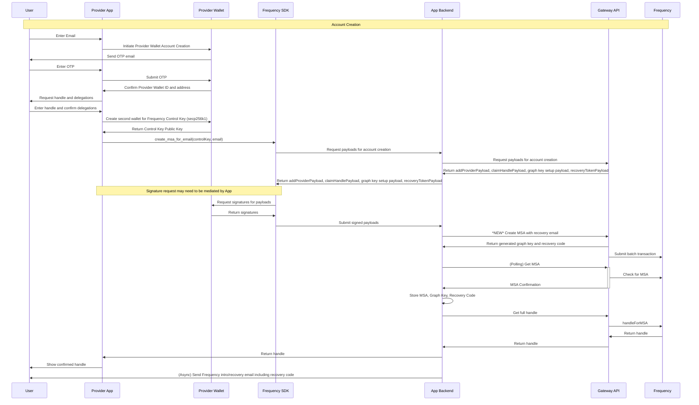
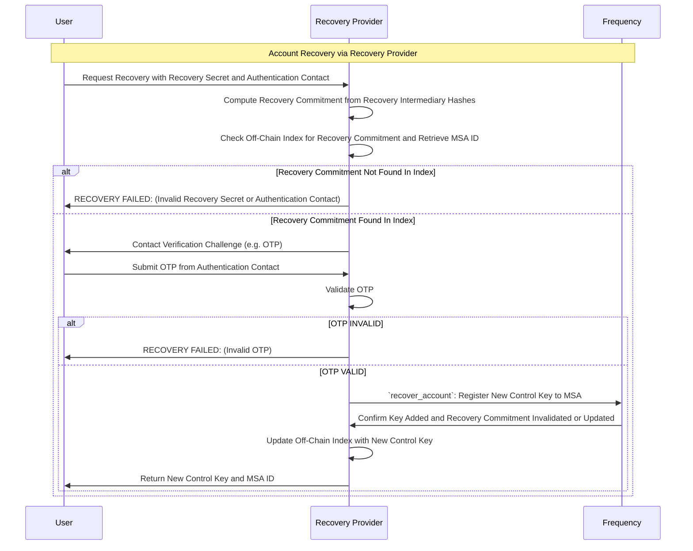

# Secure Account Recovery System Design for Frequency MSA

## Context and Scope

When a Frequency blockchain user’s wallet provider becomes unavailable, recovering control of their on-chain identity (Message Source Account, MSA) is critical. This document designs a secure account recovery system that lets users regain access to their MSA ID through governance-approved recovery providers. It outlines the cryptographic scheme, end-to-end workflows, security rationale, and implementation considerations. The goal is a robust recovery process that preserves decentralization and user security, even if the original wallet or provider is lost.

## Key Requirements

### Functional Requirements

1. Recovery Secret Generation: On MSA creation, the wallet provider collects the user’s Authentication Contact method and generates a Recovery Secret using the Authentication Contact to seed a random 32 byte hexadecimal value. The Recovery Commitment (RC) is computed from the [Recovery Intermediary Hashes](#glossary-of-terms) and the resulting RC is securely stored on-chain to allow future recovery.

2. Single Active Recovery Commitment: A maximum of one Recovery Commitment exists per user at any time. If a Recovery Commitment is ever used (consumed) during account recovery, it is invalidated on-chain. The user or new provider may then issue a new Recovery Secret for future use, but duplicate or old commitments cannot remain active simultaneously.

3. Governance-Approved Providers: Recovery operations are performed by special Recovery Providers that are approved via on-chain governance (listed in a registry). When a user needs account recovery, they contact one of these providers trusted to do the Contact Verification and submit their Recovery Secret along with their Authentication Contact information.

4. Validation by Recovery Provider: The Recovery Provider must validate two things off-chain: (a) the submitted Recovery Secret (in combination with the Authentication Contact information) matches the on-chain Recovery Commitment for some MSA ID (proving the key is valid for that account), and (b) the provided Authentication Contact is truly controlled by the user (e.g. via a secure email verification challenge). Only if both checks pass is recovery authorized.

    Note: The Recovery Provider must maintain an off-chain mapping of Recovery Commitments to MSA IDs. The blockchain will not store this mapping directly. The MSA ID is required to execute the `recover_account` extrinsic.

5. On-Chain Key Addition: After successful validation, the Recovery Provider accepts or generates a new Control Key for the user (typically a new key pair) and uses a blockchain transaction (`recover_account`) to associate this new Control Key with the user’s MSA ID on-chain. This effectively restores user control. The old compromised or inaccessible key(s) can be removed or left unused; the new key will have full control of the MSA.

6. User Notification: Finally, the provider delivers the MSA ID (if the user doesn’t know it) and the new Control Key credentials, or Provider Approved Login Credentials to the user through a secure channel. The user can now access their MSA with the new Control Key going forward.

### Security Requirements

1. High Entropy & Cryptographic Strength: The Recovery Secret generation scheme must provide sufficient entropy and cryptographic strength to resist guessing or brute-force attacks. The one-way hash (Recovery Secret + Authentication Contact) should yield an unpredictable hash with at least 128-bit security.

2. Secure Authentication Verification: The authentication step must be implemented securely to avoid vulnerabilities. The system should ensure that possession of the Authentication Contact account is verified via robust methods (e.g. time-bound one-time password (OTP) codes or magic links) without exposing the Recovery Secret or other secrets. No sensitive data is sent via email; only random verification tokens are.

3. Brute Force Resistance: Recovery Commitments (as stored on-chain) must be resistant to brute force and offline attacks. An attacker who obtains the on-chain commitment should not be able to feasibly crack it to derive the Authentication Contact or Recovery Secret. The design should incorporate strong cryptographic hashing or encryption to protect against precomputation and exhaustive search.

The following sections detail the cryptographic design meeting these requirements, the recovery workflows (with sequence diagrams), security analysis, and recommended data structures and example implementations.

## Glossary of Terms

- **MSA**: Message Source Account, the user’s on-chain identity.
- **Control Key**: The cryptographic key that allows the user to control their MSA. It is used for signing transactions and messages on the Frequency blockchain.
- **Recovery Secret**: A 32 byte hexadecimal secret derived from the user’s Authentication Contact and a random seed, used to recover access to the MSA.
- **Recovery Provider**: A third-party service approved by Frequency governance to perform account recovery operations.
- **Recovery Commitment**: A cryptographic commitment derived from the Recovery Secret and Authentication Contact, stored on-chain to allow recovery.
- **Control Key**: A cryptographic key that allows the user to control their MSA. It can be a public key used for signing transactions or messages on the Frequency blockchain.
- **Governance**: The on-chain mechanism that approves and manages recovery providers, ensuring they follow the protocol rules and security standards.
- **Authentication Contact**: The user’s chosen method for receiving recovery-related communications, typically an email address or phone number.
- **Contact Verification**: The process of confirming the user’s Authentication Contact method for recovery communications.
- **Provider Approved Login Credentials**: Alternative authentication method (such as username/password or OAuth tokens) provided by the Recovery Provider when the user does not directly manage their own Control Key.
- **Recovery Intermediary Hashes**: A pair of cryptographic hashes that are used to protect the Secret and the Authentication Contact from needing to be published on chain during recovery.

## Cryptographic Design & Rationale

### Recovery Secret Composition

Each user’s Recovery Secret is derived from a combination of their Authentication Contact and a random secret. This design proposes using a 32 byte random hexadecimal value as the random secret component due to creating high entropy and user-friendliness.

### Recovery Commitment Generation

The blockchain combines the user’s Recovery Secret with the Authentication Contact, in the form of the Recovery Intermediary Hashes to preserve secrecy, in a secure way.

Implementation: Deterministic Hash (One-Way): Compute a cryptographic hash

Note: Here `+` denotes concatenation of byte arrays.

#### Recovery Intermediary Hashes

- H(s) = keccak256(Recovery Secret)
- H(sc) = keccak256(Recovery Secret + Authentication Contact)  

#### Final Recovery Commitment (RC)

- RC = keccak256(H(s) + H(sc))

In this scheme, given the correct Recovery Secret and Authentication Contact, Recovery Providers can recompute the Recovery Commitment (RC) and match the on-chain RC value to verify the combination. This is effectively a commitment to the Recovery Secret + Authentication Contact. The user’s Recovery Secret is not stored on-chain, only the Recovery Commitment, so it cannot be directly recovered by anyone.

Note: The Authentication Contact is typically the user’s email address, but could also be a phone number or other identifier. The hash ensures that even if the Authentication Contact is known, the Recovery Secret remains secure. The Authentication Contact must be normalized (e.g. lowercased for emails, whitespace removed, etc., or convert to [E.164](https://en.wikipedia.org/wiki/E.164) format for phone numbers) before hashing to ensure consistent results.

TODO: Specify the email normalization process and any other specific requirements for the Authentication Contact format.

### Hash Algorithm

This design uses a keccak256 hash function for the Recovery Commitment (RC) due to its widespread use in blockchain applications and its security properties. The hash is computed as follows:

```rust
// Pseudocode for computing the Recovery Commitment from the Recovery Intermediary Hashes
// The function accepts the Recovery Intermediary Hash A: hash(recovery secret),
//                  and the Recovery Intermediary Hash B: hash(recovery secret + authentication contact)
fn compute_recovery_commitment(recovery_intermediary_a: [u8; 32], recovery_intermediary_b: [u8; 32]) -> [u8; 32] {
    let mut hasher = Keccak256::new();
    hasher.update(recovery_intermediary_a);
    hasher.update(recovery_intermediary_b);
    hasher.finalize().into()
}
```

### Recovery Secret Distribution to User

After generation, the hexadecimal Recovery Secret is given to the user to hold. The provider must instruct the user to safely back up this Recovery Secret, similar to how one would back up a wallet mnemonic. This design seeks to ensure that possession of the Recovery Secret is limited to the user (something they have), complementing the Contact Verification (something they control). This two-factor approach is still secure if the Recovery Secret is sent via email, as long as the Contact Verification step is robust.

The suggested format to display the Recovery Secret to the user is in four character groups for readability, e.g. `B62A-23AC-3C16-77CC-E9E0-B766-929F-5ECF-4819-0A30-8E1A-387E-D39E-10CE-03AA-A5CF`

### Entropy and Security

By using a cryptographically secure random secret of 256 bits, we ensure the Recovery Secret cannot be guessed or enumerated by attackers. A 256-bit key has 2^256 possibilities, which is beyond computational reach. In practice, 128-bit is considered secure for the foreseeable future, meeting [NIST’s](https://nvlpubs.nist.gov/nistpubs/SpecialPublications/NIST.SP.800-131Ar2.pdf]) recommended minimum of ~112-bit security strength for new systems, and aligning with 128-bit standards for encryption and hashing going forward. This high entropy addresses the security requirement for brute force resistance.

### One-time Use & Rotation

The on-chain design allows single-use Recovery Secrets. The chain will enforce that only one Recovery Secret entry exists per MSA. If a Recovery Secret is ever used in the recovery process, the act of recovery will trigger its invalidation (removal). To implement this, the recovery extrinsic (described later) will clear the stored hash. This prevents re-play: an attacker can’t re-use an old Recovery Secret to perform a second recovery on the same account. If the user wants to regain a recovery option after using it, they (with their newly recovered access) can register a fresh Recovery Secret with a provider. This fulfills the requirement that “the previous recovery code becomes invalid” after use.

## System Workflow

### 1. Account Creation & Recovery Secret Issuance

When a user first creates an account (MSA) through a wallet provider, the provider will ask the blockchain to generate and register a Recovery Secret for that user as part of the setup. The sequence diagram below illustrates this process:



#### Sequence diagram – Account creation and Recovery Secret setup

1. User Account Creation: The user signs up with a wallet/app (the provider) and provides their Authentication Contact as part of registration. The provider creates a new MSA on the Frequency blockchain for the user. During this on-chain account creation, the user’s initial Control Key (public key) is linked to the MSA (this may be a key managed by the provider).

2. Recovery Secret Generation: The blockchain generates a random secret (e.g. a 256-bit entropy value). It will call a secure random generator to get 32 bytes and then encode as a hexadecimal phrase.

3. On-Chain Storage: The blockchain stores the Recovery Commitment (RC) using the extrinsic, `add_recovery_commitment`, as part of the MSA creation process. The blockchain will store RC in association with that MSA ID.

4. User Receives Recovery Secret: Once the MSA is successfully created and the Recovery Commitment stored, the provider delivers the actual Recovery Secret to the user.

5. After account creation, the chain holds: (a) the user’s MSA ID and control key, and (b) the Recovery Commitment (bound to that MSA). The user holds: (a) their Authentication Contact, and (b) the Recovery Secret. The blockchain and provider may discard the Recovery Secret (it’s not needed by the provider anymore), keeping only the hash on-chain. The user’s responsibility is to keep the Recovery Secret safe and not share it.

### 2. Account Recovery Process

If the original wallet provider becomes unavailable or the user loses access to their account keys, the user can invoke the recovery process with a governance-approved recovery provider. The sequence is as follows:



#### Sequence Diagram – Account Recovery via a Recovery Provider

1. Initiating Recovery

    The user contacts a Recovery Provider and supplies two things to the Recovery Provider:

    - Their Recovery Secret (the secret phrase they saved).
    - Their Authentication Contact (the one they used at account creation).

2. Off-Chain Validation

    The Recovery Provider uses the submitted Recovery Secret and Authentication Contact to validate against an off-chain index of Recovery Commitments. This index is maintained by the Recovery Provider and maps Recovery Commitments to MSA IDs.

    - It computes the Recovery Commitment and determines if the off-chain index contains an MSA record with a matching Recovery Commitment.
    - If no match is found, the Recovery Provider knows the provided information is invalid. Recovery is refused and the Recovery Provider will inform the user that the Recovery Secret or Authentication Contact is incorrect.
    - If a match is found, the Recovery Provider obtains the MSA ID associated with that Recovery Commitment.

3. Contact Verification (Authentication Contact Ownership)

    The Recovery Provider securely verifies that the user controls the Authentication Contact they provided, following all [Contact Verification Security](#contact-verification-security) Requirements.

    - If the Authentication Contact ownership is verified, the Recovery Provider proceeds to the next step.
    - If the Authentication Contact ownership is not verified, recovery is aborted.

4. New Control Key Registration

    The Recovery Provider registers a new Control Key for the MSA. There are two approaches:

    - User-specified key: If the user is somewhat technical, they might generate a new key pair on their own device (e.g. via a wallet app) and only give the public key to the Recovery Provider. This is ideal for security, as the private key never leaves the user. The Recovery Provider would ask “Please paste a new public key to add to your account.” However, this requires the user to know how to create a key pair, which may not be user-friendly in an emergency.
    - Provider-generated key: The Recovery Provider can create a new key pair on behalf of the user. For instance, it generates a new Ed25519, Sr25519, or Ethereum key (compatible with Frequency). The Recovery Provider may then securely transmit the private key, or Provider Approved Login Credentials to the user after the on-chain update. This approach is simpler for the user but requires trust that the Recovery Provider deletes its copy. In practice the Recovery Provider could generate a mnemonic and show it to the user over a secure TLS connection for them to copy, minimizing its own storage of the key.

    This design recommends giving the user the option, but in either case, a public key for the new control key is decided at this step.

5. On-Chain Recovery Execution

    The Recovery Provider now submits a special Recovery extrinsic, `recover_account`, to the Frequency blockchain. This transaction does two main things atomically:

    - Invalidate Old Recovery Commitment: It clears the commitment so it cannot be reused.
    - Add New Control Key: It adds the new Control Key to the MsaId.

6. Completion and User Notification

    The blockchain emits an event confirming the Control Key addition. The Recovery Provider sees the transaction succeed and now communicates the results to the user. It may provide the user with:

    - Their MSA ID, if the user didn’t know it (users may not normally need to know their numeric MSA ID, but for transparency the Recovery Provider should tell them which account was recovered).
    - The new Control Key credentials or Provider Approved Login Credentials.

    At this point, the user can use a wallet, possibly the recovery provider’s interface or any Frequency-compatible wallet, to load the new Control Key and access their account (MSA). They should see that their data, messages, and any delegations under that MSA are intact. They have essentially regained control without needing the original provider.

    Additionally, the governance or Frequency network can record that “Recovery Provider X performed recovery for MSA Y at time Z.” Recovery Providers are trusted, but such events may be monitored to ensure no Recovery Provider is abusing the system. If a Recovery Provider is found adding keys without proper user requests, governance can revoke their recovery role. This provides an accountability layer.

7. Post-Recovery: Re-Issuing Recovery Secret

    After a successful recovery, if the user continues with a new wallet/provider, they may want to set up a new Recovery Secret for future safety (since the old one was consumed). The flow would essentially be the same as during account creation:

    - The user’s new provider (or the recovery provider, if it doubles as a wallet provider) can generate a new secret, and update the on-chain record. The chain will accept it because the previous one was invalidated. The new Recovery Commitment replaces the old.
    - This ensures the user isn’t left without a recovery option going forward. It’s an optional step but recommended. The user should be informed that they have a new Recovery Secret and the old one will no longer work.

    If the user chooses not to set a new Recovery Secret, that’s also acceptable. The system does not force a new Recovery Secret issuance; it simply allows it.

## Security Considerations

### Cryptographic Strength

The chosen scheme ensures that an attacker can’t derive any useful info from the on-chain recovery data. The hash stored on-chain is computationally infeasible to invert.

### Contact Verification Security

Relying on Authentication Contact methods brings in the security of the underlying systems. To mitigate risks:

- The verification challenges should not contain any sensitive link that directly performs actions when clicked. We suggest an OTP code approach to ensure the user manually confirms their identity on the provider’s site, reducing the chance of a phishing email tricking them.
- The code/token sent should be sufficiently long (at least 6-8 random digits or an alphanumeric string) to avoid guessing. It should expire quickly and become invalid after one use.
- The user must retrieve this code from their Authentication Contact and provide it back to the Recovery Provider (e.g. enter it on the website).
- Phishing protection: The Authentication Contact should clearly state the purpose (“Your Frequency account recovery code is…”) and not include any clickable link that could be hijacked; a plain code that the user manually copies is often considered safer.
- The provider must use TLS and other best practices when sending the email, though email by nature isn’t fully secure end-to-end. This is why the code is one-time and short-lived – even if intercepted, it’s only useful briefly and only if the attacker also has the Recovery Secret.
- Users should be advised to keep their email account secure (2FA on email, etc.), since if an attacker compromises their email and somehow finds the recovery phrase, that could enable unauthorized recovery. This essentially parallels password reset security on traditional platforms – email is the fallback, so it must be protected.

### Provider Trust and Governance

Recovery Providers are semi-trusted entities. They are given the power to initiate account changes (adding keys), so they must be constrained and monitored:

- Only providers explicitly approved by Frequency governance can register as Recovery Providers. This likely involves background checks or staking a bond. The list of authorized providers is stored on-chain.
- Recovery Providers must authenticate themselves when calling the recovery extrinsic. This might be inherent (the extrinsic origin is signed by the Recovery Provider’s account, which the runtime checks against the approved list).
- Misconduct by a Recovery Provider (e.g. recovering accounts without permission, or failing to verify identity properly) would be detectable through user reports. The governance committee could then remove that Recovery Provider from the approved list, and possibly even revert malicious changes if community consensus deems it necessary

### One-time Key Use Enforcement

The contract that the Recovery Secret is one-time is enforced by design:

- The chain will not allow a second use of the same Recovery Commitment. After it’s cleared, if someone tried to reuse the same secret, the lookup would fail (no match).
- If an attacker somehow eavesdropped on the secret during a legitimate recovery, trying to use it again would not work because it’s already consumed.
- Users are also advised: once you use your Recovery Secret, consider it spent. If for any reason they suspect it was observed, they should treat it like a password that has been changed.

### Defense Against Guessing Attacks

Could an attacker attempt to guess Recovery Secrets by trying many emails and secrets? The worst-case scenario would be an attacker who knows a user’s email and attempts to brute force the secret phrase. Because the secret is 256 random bits, the search space is astronomically large (2^256). Even using a powerful hash cracking rig, this is not feasible. As an additional safeguard, the blockchain or Recovery Providers could rate-limit recovery attempts (e.g. a Recovery Provider might refuse too many failed submissions from the same IP or email). On-chain, if someone attempted to spam the recovery extrinsic with random secrets, they’d have to pay transaction fees each time, providing an economic disincentive.

### Privacy

Storing the Recovery Commitment on-chain does not reveal the user’s Authentication Contact or any personal data in plaintext. The Authentication Contact is indirectly included in the hash but cannot be extracted from it. An observer cannot tell even if two accounts used the same Authentication Contact, because each hash will differ due to the random secret component. The Recovery Providers handling Authentication Contacts and recovery know the Authentication Contact, so users entrust that info to the Recovery Provider just as they did to the original provider. All providers should have privacy policies in place, misuse of personal data is less likely. Nevertheless, minimizing on-chain exposure of Authentication Contacts is a deliberate choice.

### Denial-of-Service Considerations

The system should be robust against DoS attacks. For example, an attacker might flood a recovery provider with false requests or attempt many wrong OTP entries to lock accounts. Providers should implement standard anti-abuse measures: CAPTCHA, request rate limiting, short OTP expiry and lockout after several wrong attempts. On-chain, the recovery extrinsic could carry a fee or require the provider’s signature, preventing mass spam on the blockchain side.

### Entropy of Email as Factor

Emails can sometimes be guessed or enumerated (many people use common domains, etc.), which is why the random seed is critical. Including the email in the hash does personalize the hash but isn’t relied upon for secrecy. The email’s main role is for the provider to confirm identity. We ensure that even if an attacker knows the target email, they still gain nothing without the recovery code. Conversely, if they somehow got the recovery code, without access to the email the recovery would fail. This dual requirement provides a balanced security.

In summary, the system meets the security requirements by layering cryptographic protections and real-world identity verification. It is designed such that no single point of failure (neither just an email, nor just a recovery code, nor a rogue provider) can compromise an account alone:

- The cryptography ensures that only a user with the correct secret can ever pass the hash check.
- The Authentication Contact check ensures the user’s physical identity is tied to the request.
- Governance oversight ensures providers operate within strict guidelines.

## On Chain Structure

### Primitives

```rust
/// RecoveryCommitment is a 32-byte hash computed from the Recovery Intermediary Hashes.
pub type RecoveryCommitment = [u8; 32];

/// This payload needs to be signed by the MSA owner to add a Recovery Commitment
pub struct RecoveryCommitmentPayload<T: Config> {
    pub recovery_commitment: RecoveryCommitment,
    /// The block number at which a signed proof of this payload expires
    pub expiration: BlockNumberFor<T>,
}

/// Authentication Contact types supported by the recovery system
#[derive(Encode, Decode, Clone, PartialEq, Eq, RuntimeDebug, TypeInfo)]
pub enum AuthenticationContactType {
    /// Email address contact type
    Email = 0x00,
    /// Phone number contact type (E.164 format)
    PhoneNumber = 0x01,
    /// Future extension for other contact types
    /// Could include social media handles, attestation-based contacts, etc.
}

/// Authentication Contact structure with type-safe encoding
/// Format: [type_byte] + [contact_data_bytes]
/// Example: 0x00 + utf8_to_bytes("user@example.com")
#[derive(Encode, Decode, Clone, PartialEq, Eq, RuntimeDebug, TypeInfo)]
pub struct AuthenticationContact {
    pub contact_type: AuthenticationContactType,
    pub contact_data: Vec<u8>,
}

/// New Events for the Recovery System
/// These events are emitted by the MSA pallet to indicate successful operations related to Recovery Secrets.
#[pallet::event]
#[pallet::generate_deposit(pub(super) fn deposit_event)]
pub enum Event<T: Config> {
    /// A Recovery Commitment was added to an existing MSA
    RecoveryCommitmentAdded {
        who: T::AccountId,
        msa_id: MsaId,
    },
    /// An account was recovered with a new control key
    AccountRecovered {
        who: T::AccountId,
        msa_id: MsaId,
        new_control_key: T::PublicKey, // New control key added to the MSA
    },
    /// A Recovery Commitment was invalidated after use or removal
    RecoveryCommitmentInvalidated {
        who: T::AccountId,
        msa_id: MsaId,
    },
}
```

### Storage Structures

```rust
/// Storage type for a MsaID to Recovery Commitment information
/// - Key: MsaId
/// - Value: RecoveryCommitment
#[pallet::storage]
pub type MsaIdToRecoveryCommitment<T: Config> = StorageMap<_, Twox64Concat, MsaId, RecoveryCommitment>;
```

## Required Extrinsics

|Name/Description|Caller|Payment|Key Events|Runtime Added|
|---|---|---|---|---|
| `add_recovery_commitment`<br />Add a new Recovery Commitment to an existing MSA| Provider| Capacity or Tokens | [`RecoveryCommitmentAdded`](https://frequency-chain.github.io/frequency/pallet_msa/pallet/enum.Event.html#variant.RecoveryCommitmentAdded)| 166|
| `recover_account`<br />Recover MSA with new control key| Recovery Provider | Capacity or Tokens | [`AccountRecovered`](https://frequency-chain.github.io/frequency/pallet_msa/pallet/enum.Event.html#variant.AccountRecovered), [`RecoveryCommitmentInvalidated`](https://frequency-chain.github.io/frequency/pallet_msa/pallet/enum.Event.html#variant.RecoveryCommitmentInvalidated) | 166|

### Add Recovery Commitment

This extrinsic allows a provider to add a new Recovery Commitment to an existing MSA. It can be used during account creation or later to update the Recovery Commitment.

```rust
// Pseudo-code for adding a Recovery Commitment to an existing MSA
pub fn add_recovery_commitment(
    origin: OriginFor<T>,
    msa_owner_key: T::AccountId,
    proof: MultiSignature,
    payload: RecoveryCommitmentPayload,
) -> DispatchResult {
    let provider_key = ensure_signed(origin)?;

    // Verify that the MsaId owner has signed the payload
    ensure!(
        Self::verify_signature(&proof, &msa_owner_key, &payload),
        Error::<T>::InvalidSignature
    )

    // Register the signature to prevent replay attacks
    Self::register_signature(&proof, payload.expiration.into());
    
    // Recover the MSA ID from the msa_owner_key
    let msa_id = ensure_valid_msa_key(&msa_owner_key);

    // Store the new RecoveryCommitment
    MsaIdToRecoveryCommitment::<T>::insert(msa_id, payload.recovery_commitment);
    Self::deposit_event(Event::RecoveryCommitmentAdded {
      who: msa_owner_key,
      msa_id,
    });

    Ok(())
}
```

### Recover Account

This extrinsic is called by the Recovery Provider after verifying the user’s Recovery Intermediary Hashes. It adds a new Control Key to the MSA and invalidates the old Recovery Commitment.

```rust
// Pseudo-code for recovering an account with a new control key
pub fn recover_account(
    origin: OriginFor<T>,
    msa_id: MsaId,
    new_control_key: Vec<u8>,
    pub intermediary_hash_a: Vec<u8>, // The hash of (Recovery Secret)
    pub intermediary_hash_b: Vec<u8>, // The hash of (Recovery Secret + Authentication Contact)
) -> DispatchResult {
    let who = ensure_signed(origin)?;

    // Verify that the Recovery Provider is a registered Recovery Provider
    ensure!(
        T::RecoveryProviderRegistry::is_recovery_provider(&who),
        Error::<T>::NotAuthorizedRecoveryProvider
    );

    let recovery_commitment = compute_recovery_commitment(intermediary_hash_a, intermediary_hash_b);

    // Verify the recovery commitment exists
    let maybe_recovery_commitment = MsaIdToRecoveryCommitment::<T>::get(&msa_id)
        .ok_or(Error::<T>::RecoveryCommitmentNotFound)?;

    // Ensure the Recovery Commitment matches the on-chain value
    ensure!(maybe_recovery_commitment == recovery_commitment, Error::<T>::RecoveryCommitmentMismatch);

    // Invalidate the old Recovery Commitment by removing it from storage
    MsaIdToRecoveryCommitment::<T>::remove(&maybe_msa_id);
    Self::deposit_event(Event::RecoveryCommitmentInvalidated { msa_id: maybe_msa_id });

    // Add the new control key to the MSA
    // Note: This would integrate with existing MSA pallet functionality
    // The RP may first have to acquire the proper delegations from the user or this operation may fail
    // Required delegation operations omitted for brevity
    T::MsaPallet::add_public_key_to_msa(who.clone(), msa_id, new_control_key)?;

    Self::deposit_event(Event::AccountRecovered { who, msa_id });
    Ok(())
}
```
