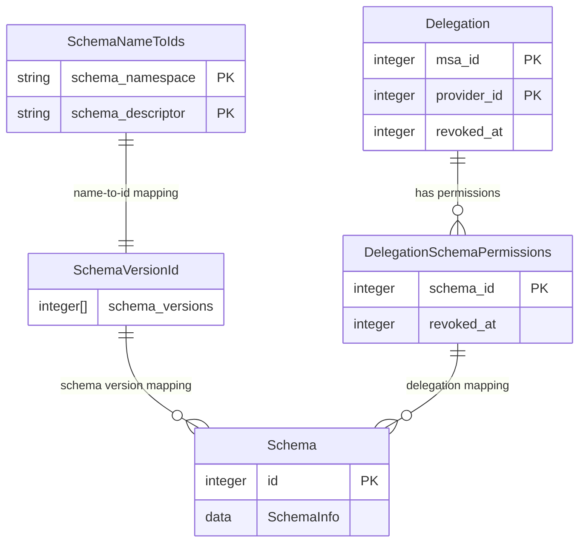
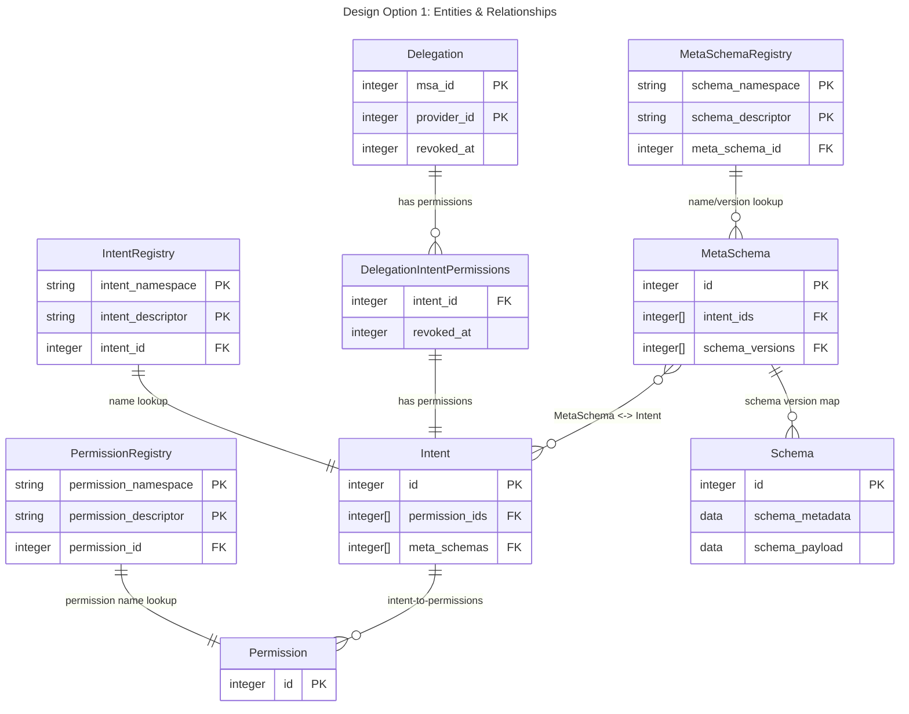
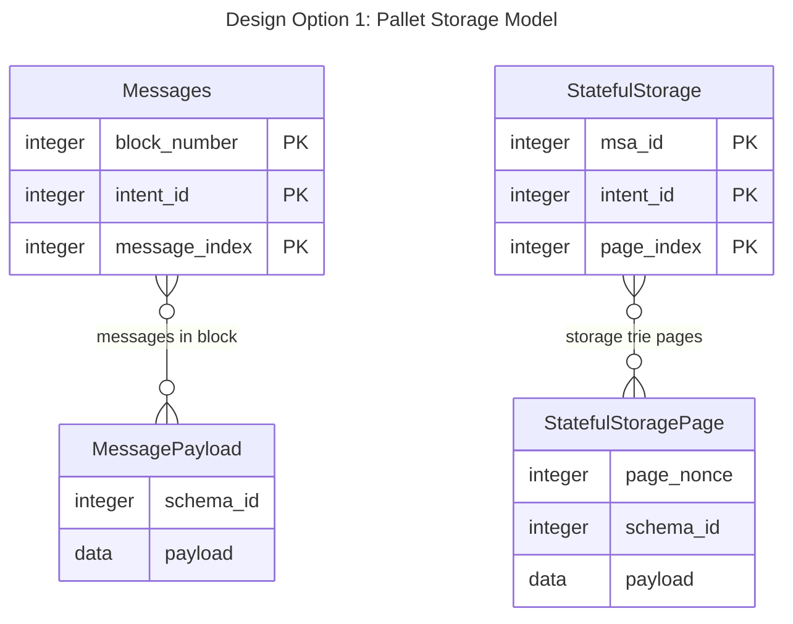
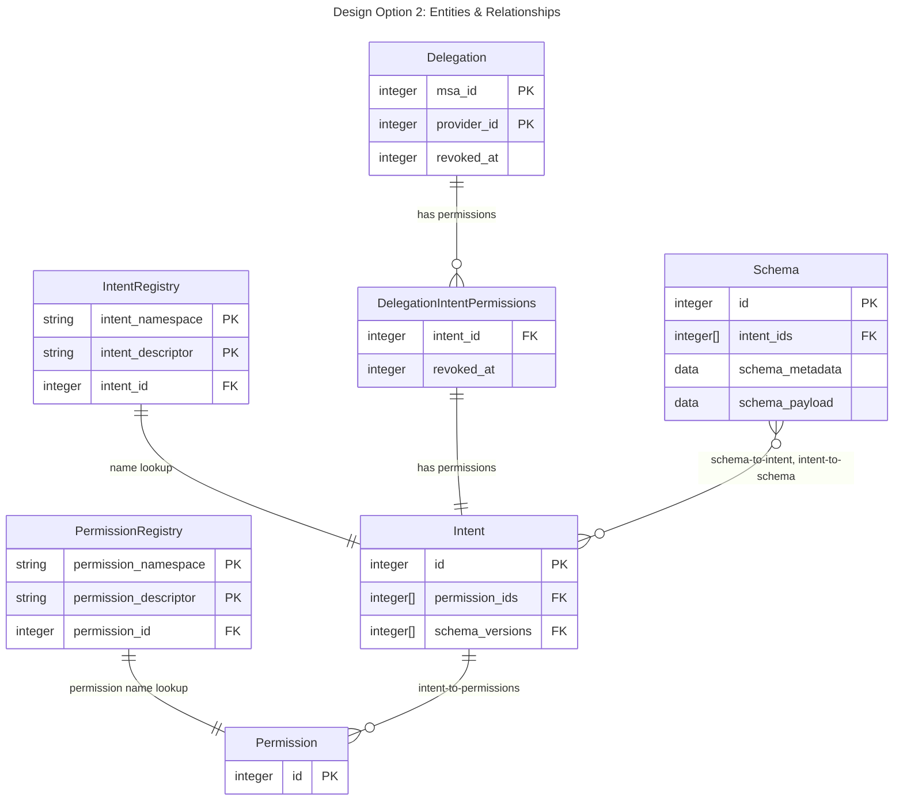

# 📘 Design Discussion: Schema, Protocols, and Intent-Based Delegation in Frequency

## 0. **Work in Progress** 

Note: This document is a work in progress; specific implementation details and code examples exhibited herein are for
illustrative purposes only. Once the various questions and concerns surfaced by this "pre-design" document have be
answered satisfactorily, the document will be updated and expanded to include specific details related to the proposed
implementation.

## 1. **Background and Motivation** 

In the current implementation, schemas are registered with immutable numeric identifiers (`SchemaId`) and describe the
layout and storage semantics (e.g., Avro/Parquet formats, on-chain/off-chain storage). These schema IDs are used as
references by clients and runtime modules alike, particularly in the delegation system defined by the `msa` pallet.

Delegations currently allow a user to authorize a provider (e.g., an app or service) to act on their behalf, but this
authorization is tightly bound to a specific `SchemaId`. This model has proven limiting in several ways:

- **Coupling between schema versions and delegations**
- **Schemas represent data format, not purpose**
- **Lack of human-readable context**

These limitations have motivated a re-architecture of the schema and delegation systems to introduce the concepts of:

- **Named intents** with version tracking
- **Intent-based delegation**
- **More expressive APIs and storage models**

## 2. **Design Goals** 

This section outlines the key objectives that guide the redesign of Frequency's schema and delegation architecture.

- **Schema Immutability** - Individual schema versions, once published, are immutable on-chain
- **Minimal Delegation Churn** - Minor changes to data formats should not require new delegations
- **Minimal Storage Churn (migrations)** - Minor changes to storage formats should not require mass migration of user
  data
- **Intent Separation** - When permissioning, we need to be able to separate the purpose of the data and action from its
  format
- **On-Chain Efficiency** - On-chain operations need to be efficient, so storage and structures must be designed with
  that in mind

# Current Design

# Design Option 1: Immutable, Versioned Schemas with Permissions & Intents

## Notes

- `Intents` MUST be mutable; otherwise there's little benefit to them (the main benefit of an Intent being that it
  enables mutating the collection of permissions without requiring a new delegation)
- `Schemas` are NOT mutable; they represent a fixed format & payload location
- `MetaSchemas` are mutable in two senses:
    - The version array is updated as new Schemas are published
    - The list of implemented intents may be updated as Intents are added or modified
- The bi-directional lookup on `Intent` <--> `MetaSchema` is crucial to mitigating the runtime cost of delegation
  lookups
- The cost of doing a Delegation lookup for a particular Schema increases as follows:
    - 1 additional storage READ of the Schema's associated `MetaSchema`
    - Once the Delegation BTree is read from storage (already done currently), instead of a single keyed BTree lookup,
      must do
      an iterative lookup or set comparison between the intents implemented by the MetaSchema and the intents contained
      in the Delegation.
- Because stored data retains an indication of the concrete `SchemaId` that was used to write it, there is ZERO risk of
  introducing a breaking format change, as users will always have access to the correct schema needed to decode the
  data.

## Notes

This storage model requires migrations for both the `messages` and `stateful-storage` pallets, to include the concrete
`SchemaId` that was used to write the payload. The downstream benefit of this is that future schema updates (ie, _minor_
updates) would not require a storage migration; instead, storage could be updated opportunistically as new data is
written. Only updates that involve a completely new `MetaSchema` would require a migration; this would be considered a
major breaking change to the data.

# Design Option 2: Mutable, Backward-compatible Schemas with Permissions & Intents

## Notes

- `Intents` MUST be mutable; otherwise there's little benefit to them (the main benefit of an Intent being that it
  enables mutating the collection of permissions without requiring a new delegation)
- `Schemas` are mutable/evolvable, but only to the extent that they are backwards-compatible
    - Easy to validate off-chain using actual chain data for non-encrypted data before approving Schema updates
    - Validating updates for schemas that include encrypted data must rely on test data
    - Risk of missing a format-breaking change, therefore, is low--but not zero
- The bi-directional lookup on `Intent` <--> `Schema` is crucial to mitigating the runtime cost of delegation
  lookups
- The cost of doing a Delegation lookup for a particular Schema increases as follows:
    - Once the Delegation BTree is read from storage (already done currently), instead of a single keyed BTree lookup,
      must do an iterative lookup or set comparison between the intents implemented by the MetaSchema and the intents
      contained in the Delegation.
- This approach does not need to modify `messages` or `stateful-storage` pallet storage, as schema updates are
  non-breaking. Major updates involving a new Schema would require appropriate migrations as currently.

# Summary

## TL;DR: Trade-offs between the two approaches:

### Option 1:

Pros:

- Can withstand complete breaking format changes without requiring up-front storage migrations.

Cons:

- Has an additional cost of `1 READ` per delegation lookup vs Option 2
- More complexity due to the added architectural layer of `MetaSchema`
- Up-front cost to migrate storage for `messages` and `stateful-storage`

### Option 2:

Pros:

- 1 less storage READ per delegation lookup vs Option 1
- Less complex
- No up-front storage migrations

Cons:

- Allowable Schema updates are somewhat narrowly defined; can only withstand fully backward-compatible format changes
  without requiring a new Schema (and thus a migration)

Both approaches rely on Governance to be the gatekeepers of Schema or Intent changes that violate the initial stated
purpose/use/intent of the data being stored.