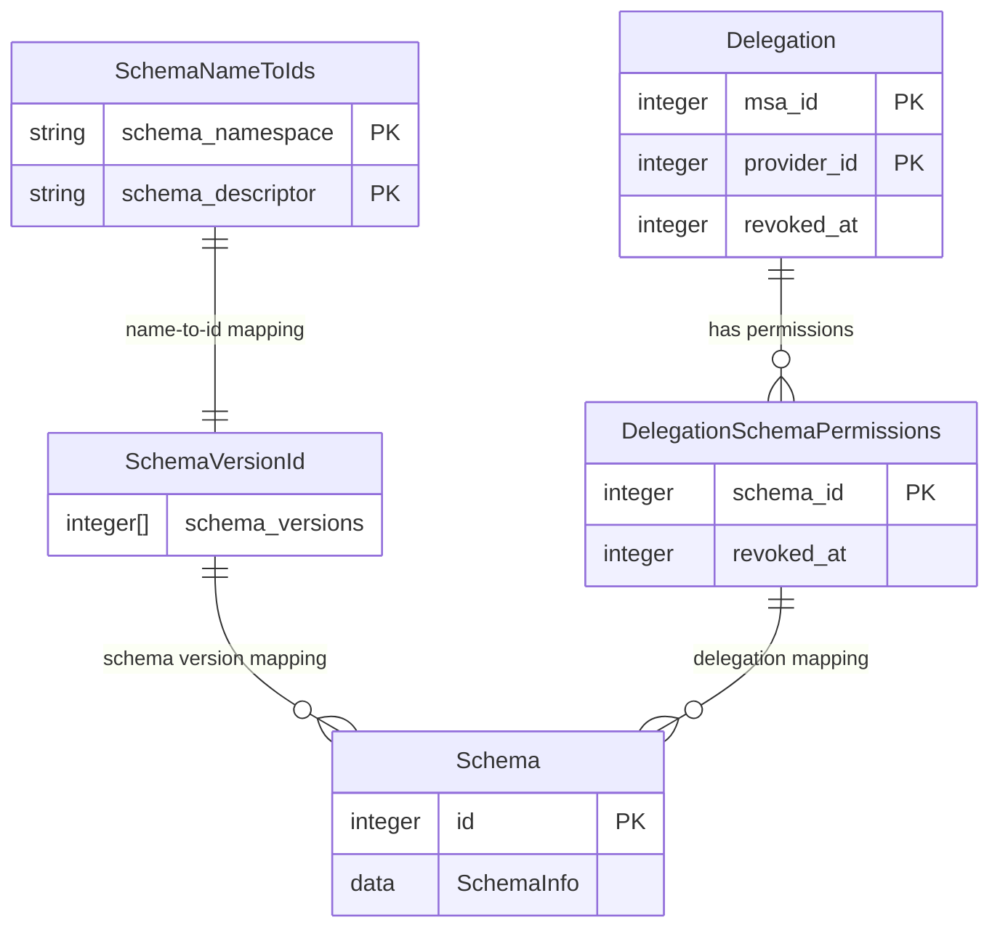
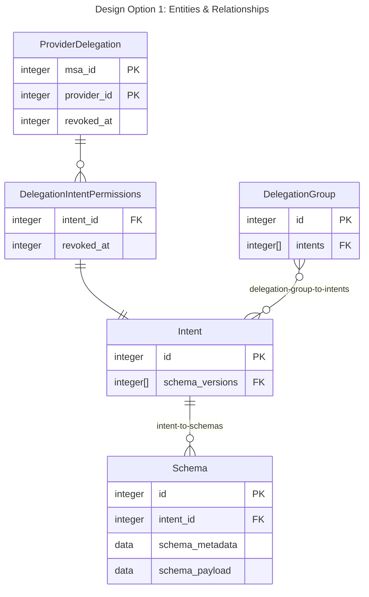
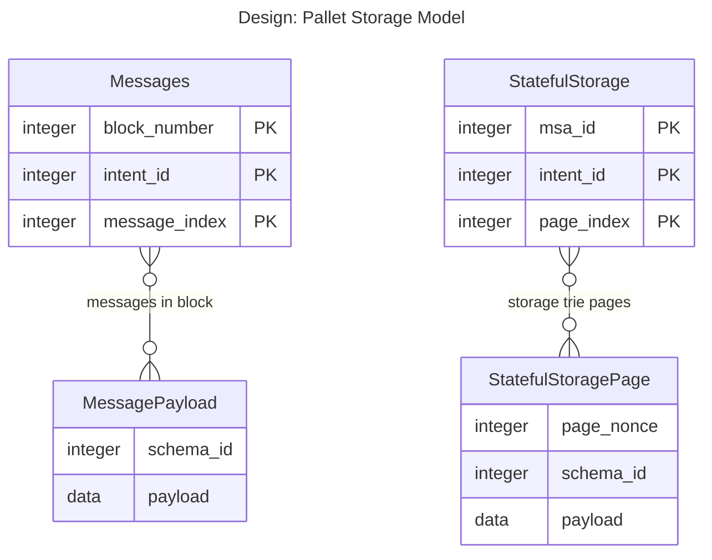

# 📘 Design Discussion: Schema, Protocols, and Intent-Based Delegation in Frequency

## 0. **Work in Progress** 

Note: This document is a work in progress; specific implementation details and code examples exhibited herein are for
illustrative purposes only. Once the various questions and concerns surfaced by this "pre-design" document have be
answered satisfactorily, the document will be updated and expanded to include specific details related to the proposed
implementation.

## 1. **Background and Motivation** 

In the current implementation, schemas are registered with immutable numeric identifiers (`SchemaId`) and describe the
layout and storage semantics (e.g., Avro/Parquet formats, on-chain/off-chain storage). These schema IDs are used as
references by clients and runtime modules alike, particularly in the delegation system defined by the `msa` pallet.

Delegations currently allow a user to authorize a provider (e.g., an app or service) to act on their behalf, but this
authorization is tightly bound to a specific `SchemaId`. This model has proven limiting in several ways:

- **Coupling between schema versions and delegations**
- **Schemas represent data format, not purpose**
- **Lack of human-readable context**

These limitations have motivated a re-architecture of the schema and delegation systems to introduce the concepts of:

- **Named intents** with version tracking
- **Intent-based delegation**
- **More expressive APIs and storage models**

## 2. **Design Goals** 

This section outlines the key objectives that guide the redesign of Frequency's schema and delegation architecture.

- **Schema Immutability** - Individual schema versions, once published, are immutable on-chain
- **Minimal Delegation Churn** - Minor changes to data formats should not require new delegations
- **Minimal Storage Churn (migrations)** - Minor changes to storage formats should not require mass migration of user
  data
- **Intent Separation** - When permissioning, we need to be able to separate the purpose of the data and action from its
  format
- **On-Chain Efficiency** - On-chain operations need to be efficient, so storage and structures must be designed with
  that in mind

# Current Design

# Design: Immutable, Versioned Schemas with Permissions & Intents

NOTE: For simplicity, I've omitted showing entities/relations whose sole purpose is providing name-to-id lookup for
off-chain clients

## Notes

- `Intents` MUST be mutable; otherwise there's little benefit to them (the main benefit of an Intent being that it
  enables mutating the collection of permissions without requiring a new delegation)
- `Schemas` are NOT mutable; they represent a fixed format & payload location
- The bi-directional lookup on `Intent` <--> `Schema` is crucial to mitigating the runtime cost of delegation lookups
- The cost of doing a Delegation lookup for a particular Schema is the same as the current implementation
- `DelegationGroups` are _mutable_--but, critically, are not themselves delegatable. That is, granting delegations by
  DelegationGroup merely creates the individual Intent delegations that exist in the group _at the time of delegation_;
  subsequent mutations of the DelegationGroup do not affect existing delegations. Granting delegations in this way may
  be supported by new extrinsics, or may simply be left to the client to query the DelegationGroup and request the
  indicated delegations.
- Because stored data retains an indication of the concrete `SchemaId` that was used to write it, there is ZERO risk of
  introducing a breaking format change, as users will always have access to the correct schema needed to decode the
  data.

## Notes

This design separates the notion of _storage location_ from _data format_ (ie, `Schema`). _Storage location_ is now tied
to `IntentId`.

The design requires modifications to the pallet storage structures for both the `messages` and `stateful-storage`
pallets. While this could be accomplished via a migration of all existing pallet data, the amount of data that currently
exists on-chain makes this problematic. If the cost or complexity of such a migration renders it infeasible, the
following approach is proposed:

### `messages` pallet

Since `messages` pallet storage represents time-series content publications, it should be possible to define a
`MessagesV3` pallet storage (the current storage being `MessagesV2`). All future write operations would write to
`MessagesV3`. For reads, we would store the block number at which `MessagesV3` was introduced; read requests for data
prior to that block would read from `MessagesV2`.

### `stateful-storage` pallet

Data stored in the `stateful-storage` pallet always represents the latest state, rather than a time-series. Therefore,
it's difficult or impossible to bifurcate the storage in the same way as the `messages` pallet. Instead, to avoid
requiring a complete storage migration, new pages/items that are written can include a _storage version magic number_ in
either the page or the item header. For `Paginated` storage, this value would precede the `PageNonce`; for `Itemized`
storage the value would precede `payload_len`. The 'magic number' would be designed to be the same byte length as the
value currently a byte offset zero within the page/item, and to be a value such that conflict with a valid `nonce` or
`payload_len` would be highly unlikely, if not impossible.

New structures would be defined, ie `PageV2` and `ItemizedItemV2`, and decoding values read from storage would need to
determine which structure to decode to based on the presence/absence of the "magic value".

## Additional

Other features are also considered for implementation, but not discussed above; they do not significantly affect the
cmoplexity or nature of the proposed design:

- Deprecation of schemas/allow only 1 active _writeable_ Schema per Intent
- Name registries for off-chain lookup