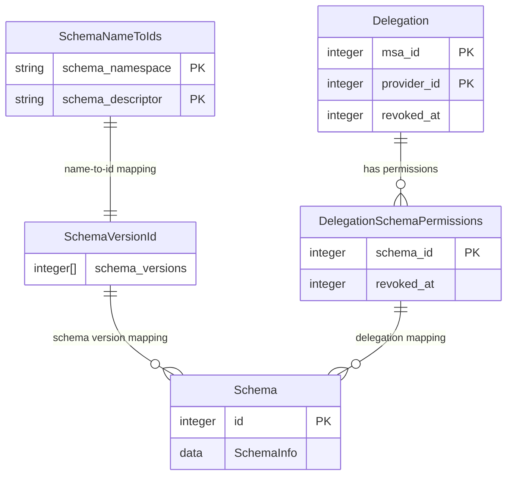
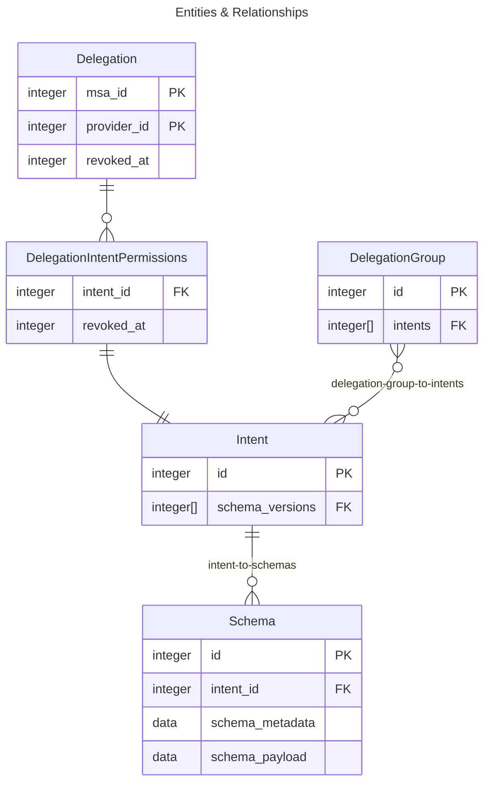
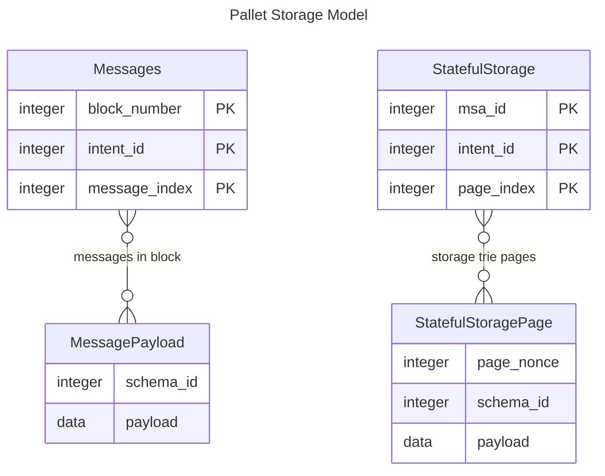

# 📘 Design Discussion: Schema, Protocols, and Intent-Based Delegation in Frequency

## 1. **Background and Motivation** <a id="section_1"></a>

In the current implementation, schemas are registered with immutable numeric identifiers (`SchemaId`) and describe the
layout and storage semantics (e.g., Avro/Parquet formats, on-chain/off-chain storage). These schema IDs are used as
references by clients and runtime modules alike, particularly in the delegation system defined by the `msa` pallet.

Delegations currently allow a user to authorize a provider (e.g., an app or service) to act on their behalf, but this
authorization is tightly bound to a specific `SchemaId`. This model has proven limiting in several ways:

- **Coupling between schema versions and delegations**
- **Schemas represent data format, not purpose**
- **Lack of human-readable context**

These limitations have motivated a re-architecture of the schema and delegation systems to introduce the concepts of:

- **Named intents** with version tracking
- **Intent-based delegation**
- **More flexible storage models**

## 2. **Design Goals** <a id="section_2"></a>

This section outlines the key objectives that guide the redesign of Frequency's schema and delegation architecture.

- **Schema Immutability** - Individual schema versions, once published, are immutable on-chain
- **Minimal Delegation Churn** - Minor changes to data formats should not require new delegations
- **Minimal Storage Churn (migrations)** - Changes to storage formats should not require mass migration of user
  data
- **Intent Separation** - When permissioning, we need to be able to separate the purpose of the data and action from its
  format
- **On-Chain Efficiency** - On-chain operations need to be efficient, so storage and structures must be designed with
  that in mind

## 3. **Current Design** <a id="current_design"></a>



## 4.**Proposed Design Diagram: Immutable, Versioned Schemas with Intents**<a id="proposed_design"></a>

NOTE: For simplicity, I've omitted showing entities/relations whose sole purpose is providing name-to-id lookup for
off-chain clients



### Notes

- `Intents` MUST be mutable; otherwise there's little benefit to them (the main benefit of an Intent being that it
  enables mutating the collection of permissions without requiring a new delegation)
- `Schemas` are NOT mutable; they represent a fixed format & payload location
- The bi-directional lookup on `Intent` <--> `Schema` is crucial to mitigating the runtime cost of delegation lookups
- The cost of doing a Delegation lookup for a particular Schema is the same as the current implementation
- `DelegationGroups` are _mutable_--but, critically, are not themselves delegatable. That is, granting delegations by
  DelegationGroup merely creates the individual Intent delegations that exist in the group _at the time of delegation_;
  subsequent mutations of the DelegationGroup do not affect existing delegations. Granting delegations in this way may
  be supported by new extrinsics, or may simply be left to the client to query the DelegationGroup and request the
  indicated delegations.
- Because stored data retains an indication of the concrete `SchemaId` that was used to write it, there is ZERO risk of
  introducing a breaking format change, as users will always have access to the correct schema needed to decode the
  data.



### Notes

This design separates the notion of _storage location_ from _data format_ (ie, `Schema`). _Storage location_ is now tied
to `IntentId`.

The design requires modifications to the pallet storage structures for both the `messages` and `stateful-storage`
pallets. While this could be accomplished via a migration of all existing pallet data, the amount of data that currently
exists on-chain makes this problematic. If the cost or complexity of such a migration renders it infeasible, the
following approach is proposed:

#### `messages` pallet

Since `messages` pallet storage represents time-series content publications, it should be possible to define a
`MessagesV3` pallet storage (the current storage being `MessagesV2`). All future write operations would write to
`MessagesV3`. For reads, we would store the block number at which `MessagesV3` was introduced; read requests for data
prior to that block would read from `MessagesV2`.

#### `stateful-storage` pallet

Data stored in the `stateful-storage` pallet always represents the latest state, rather than a time-series. Therefore,
it's difficult or impossible to bifurcate the storage in the same way as the `messages` pallet. Instead, to avoid
requiring a complete storage migration, new pages/items that are written can include a _storage version magic number_ in
either the page or the item header. For `Paginated` storage, this value would precede the `PageNonce`; for `Itemized`
storage the value would precede `payload_len`. The 'magic number' would be designed to be the same byte length as the
value currently a byte offset zero within the page/item, and to be a value such that conflict with a valid `nonce` or
`payload_len` would be highly unlikely, if not impossible.

New structures would be defined, ie `PageV2` and `ItemizedItemV2`, and decoding values read from storage would need to
determine which structure to decode to based on the presence/absence of the "magic value".

## 5. **Delegation Semantics**<a id="delegation_semantics"></a>

Delegation is the mechanism by which a user authorizes a provider to act on their behalf. Currently, this is limited to
individual `SchemaId`s, but we propose changing the delegation model to be based on `IntentId`. The structure of a
Delegation would not change; an initial migration would create a single `Intent` for each existing `Schema`, with the
same numeric ID, so that current Delegation storage would not require a migration.

## 6. **Schemas**<a id="schemas"></a>

In the new model, a `Schema` represents a data format definition *only*. Any association with data _meaning_ or _storage
location_ is promoted to the Schema's corresponging `Intent`. A Schema may be associated with one and only one Intent.
Under this model, a Schema has some associated metadata, and a model containing the actual data format definition (ie,
currently-supported Parquet or Avro schema). The associated data types would be as follows:

```rust
pub type SchemaId = u16;

pub type SchemaModel = BoundedVec<u8, T::SchemaModelMaxBytesBoundedVecLimit>;

pub struct SchemaInfo {
    /// The type of model (AvroBinary, Parquet, etc.)
    pub model_type: ModelType,
    /// The associated Intent
    pub intent_id: IntentId,
}
```

## 7. **Intents**<a id="intents"></a>

`Intents` represent a consistent _data meaning or purpose_ for which a user may delegate permission. Intents may be
associated with one or more Schemas, which comprise a _version list_. Via this mechanism, Intents are able to represent
the evolution of a data format. An Intent may also be associated with no schemas at all; this allows us to create
delegatable permissions or entitlements on-chain that may be checked by on- or off-chain applications.

Intents are mutable, but only in the sense that publication of new Schemas representing the same evolving data format
may be appended to an Intent. All other attributes of an Intent are immutable.

When associated with one or more Schemas, Intents also represent a _storage location_ and other attributes. This
approach allows on-chain data to evolve over time. Since the storage location of an Intent remains constant, and data is
written with an indication of the specific SchemaId used to encode it, publication of a new Schema does not require
wholesale data migration. Instead, on-chain data may be migrated by Provider applications opportunistically over time.
Off-chain data may persist in its existing form and can always be read/decoded using the original Schema definition
used to write it.

The structures and types for Intents are envisioned as follows:
<a id="intent_struct"></a>

```rust
pub type IntentId = u16;

// Renamed from existing `SchemaSetting`
pub enum IntentSetting {
    /// Intent setting to enforce append-only behavior on payload.
    /// Applied to Intents with `payload_location: PayloadLocation::Itemized`.
    AppendOnly,
    /// Intent may enforce a signature requirement on payload.
    /// Applied to intents with `payload_location: PayloadLocation::Itemized` or `PayloadLocation::Paginated`.
    SignatureRequired,
}

pub struct IntentSettings(pub BitFlags<IntentSetting>);

pub struct IntentInfo {
    /// The payload location
    pub payload_location: PayloadLocation,
    /// additional control settings for the schema
    pub settings: IntentSettings,
    /// List of Schemas associated with this Intent
    pub schema_ids: BoundedVec<SchemaId, ConstU32<MAX_NUMBER_OF_VERSIONS>>,
}
```

### 8. **Delegation Groups**<a id="delegation_groups"></a>

As mentioned <a href="#delegation_semantics">above</a>, other than changing the interpretation of a Delegation from
`SchemaId` to `IntentId`, the semantics of Delegations does not change in the new design. However, to
facilitate user provisioning and onboarding by Providers, we introduce here the concept of _Delegation Groups_.

A `DelegationGroup` is a list of `IntentIds` that are "bundled" together. These bundles may be resolved to the discrete
contained `IntentIds` when a Provider seeks to request or verify delegations for a common purpose.

Delegation Groups **must be resolved to individual `IntentIds` at the time of delegation granting**. In this sense, they
are both mutable _and_ immutable:

* _immutable_ in the sense that when granting delegations based on a Delegation Group, the list of Intents so delegated
  may not be changed without another explicit delegation action by the user.
* _mutable_ in the sense that the list of Intents associated with a Delegation Group may change over time, providing a
  mechanism to check that a user has all the necessary or desired delegations in place.

This model preserves Frequency's user-security model of _explicit delegation_, while simultaneously gives Providers a
convenience mechanism for evolving sets of permissions.

The structure for Delegation Groups is proposed as follows:

<a id="delegation_group_struct"></a>

```rust
pub type DelegationGroupId = u16;

pub struct DelegationGroup {
    /// List of Intents associated with this Delegation
    pub intent_ids: BoundedVec<IntentId, ConstU32<MAX_INTENTS_PER_GROUP>>,
}
```

### 9. **Name Resolution**<a id="name_resolution"></a>

In addition to the new & updated primitives for Schemas, Intents, and Delegation Groups, this design also provides for a
name resolution mechanism so that off-chain applications may discover the necessary on-chain identifiers. These
facilities are _solely for off-chain name resolution_; all on-chain extrinsics and other calls will require the
appropriate numeric identifier (i.e., `SchemaId`, `IntentId`, `DelegationGroupId`).

Related names will be grouped under a top-level identifier called a 'protocol'. This enables querying the chain by a
fully qualified name `<protocol>.<name>`, or by `<protocol>` only for a list of registered names and their corresponding
entities. For example, using data currently on Frequency Mainnet, we would have two protocols defined: 'dsnp' and '
bsky'.
Each name registered to a protocol points to either an `IntentId` or a `DelegationGroupId`. The structures for the name
registry would look as follows:

<a id="name_registry_struct"></a>

```rust
pub enum RegisteredNameIdType {
    Intent(IntentId),
    DelegationGroup(DelgationGroupId),
}

/// Protocol name type
pub type ProtocolName = BoundedVec<u8, ConstU32<PROTOCOL_MAX>>;
/// descriptor type
pub type NameDescriptor = BoundedVec<u8, ConstU32<DESCRIPTOR_MAX>>;
```

**NOTE:** The '\<protocol>.\<name>' mapping and registry may be replaced at some future date if Frequency implements a
true ENS registry.

### 10. Ownership and Governance<a id="ownership_governance"></a>

It may be desirable at some point to implement the concept of ownership of protocols and the entities & names registered
under them, thereby enabling the concept of publishing authority for the creation of new Intents, Schemas, and
Delegation Groups. However, that is considered out of scope of the current design. It may be evaluated at a later date,
possibly in the context of a full DAO implementation for Frequency.

Instead, for the proposed design, as with the current design, all additions & changes to Schemas, Intents, Delegation
Groups, and Name registrations must be approved by Governance. Specifically, the following actions must be
Governance-approved:

| Action                                                               | Considerations                                                                           |
|----------------------------------------------------------------------|------------------------------------------------------------------------------------------|
| Publish a new Schema                                                 | Is the Schema an evolution of existing Schemas registered to the Intent?                 |
| Publish a new (named) Intent                                         | Does the requestor represent an org with authority to publish to the indicated protocol? |
| Publish a new (named) Delegation Group<br/>Update a Delegation Group | Does the requestor represent an org with authority to publish to the indicated protocol? |

### 11. **Extrinsics**<a id="extrinsics"></a>

The following modifications to existing extrinsics are proposed:

* `propose_to_create_schema_v2`, `create_schema_via_governance_v2`, and `create_schema_v3` (deprecated)
    * Will reject if `schema_name` is `None`.
    * Will reject if `schema_name` does not resolve to an existing Intent.
    * Will reject if the supplied `payload_location` or `settings` do not match the associated Intent's values
* `propose_to_create_schema_name` and `create_schema_name_via_governance` (deprecated)
    * No-op, as schema names are no longer supported
* All extrinsics related to Delegations that reference `SchemaId` will be changed to reference `IntentId`. Since the
  data type is `u16` for both, the binary API will not change.

The following new extrinsics are proposed:

| Extrinsic                                                      | Parameters                                                                                                                                                          | Description                                                      |
|----------------------------------------------------------------|---------------------------------------------------------------------------------------------------------------------------------------------------------------------|------------------------------------------------------------------|
| propose_to_create_schema_v3<br/>create_schema_v4               | `model: BoundedVec<u8>`<br/>`model_type: ModelType`<br/>`intent_id: IntentId`                                                                                       | Propose to create a Schema<br/>Create a Schema                   |
| create_schema_via_governance_v3                                | `creator_key: AccountId`<br/>`model: BoundedVec<u8>`<br/>`model_type: ModelType`<br/>`intent_id: IntentId`                                                          | Create a Schema via governance                                   |
| propose_to_create_intent<br/>create_intent                     | `protocol_name: ProtocolName`<br/>`intent_name: NameDescriptor`<br/>`payload_location: PayloadLocation`<br/>`settings: IntentSettings`                              | Propose to create an Intent<br/>Create an Intent                 |
| create_intent_via_governance                                   | `creator_key: AccountId`<br/>`protocol_name: ProtocolName`<br/>`intent_name: NameDescriptor`<br/>`payload_location: PayloadLocation`<br/>`settings: IntentSettings` | Create an Intent via Governance                                  |
| propose_to_create_delegation_group<br/>create_delegation_group | `protocol_name: ProtocolName`<br/>`group_name: NameDescriptor`<br/>`intent_ids: BoundedVec<IntentId, MAX_INTENTS_PER_GROUP>`                                        | Propose to create a DelegationGroup<br/>Create a DelegationGroup |
| create_delegation_group_via_governance                         | `creator_key: AccountId`<br/>`protocol_name: ProtocolName`<br/>`group_name: NameDescriptor`<br/>`intent_ids: BoundedVec<IntentId, MAX_INTENTS_PER_GROUP>`           | Create a DelegationGroup via Governance                          |
| propose_to_update_delegation_group<br/>update_delegation_group | `group_id: DelegationGroupid`<br/>`intent_ids: BoundedVec<IntentId, MAX_INTENTS_PER_GROUP>`                                                                         | Propose to update a DelegationGroup<br/>Update a DelegationGroup |
| update_delegation_group_via_governance                         | `creator_key: AccountId`<br/>`group_id: DelegationGroupid`<br/>`intent_ids: BoundedVec<IntentId, MAX_INTENTS_PER_GROUP>`                                            | Update a DelegationGroup via Governance                          |

### 12. **Runtime Calls**<a id="runtime_calls"></a>

The following new Custom Runtime functions are proposed:

| Custom Runtime Function      | Parameters                                                                                                                        | Description                                                                                                                                                        |
|------------------------------|-----------------------------------------------------------------------------------------------------------------------------------|--------------------------------------------------------------------------------------------------------------------------------------------------------------------|
| resolve_intent_or_group_name | `protocol_name: ProtocolName`<br/>`descriptor_name: Option<DescriptorName>`                                                       | Resolve a name to a registered  ID or list of IDs                                                                                                                  |
| check_delegation_group       | `group_id: DelegationGroupId`<br/>`msa_id: MessageSourceId`<br/>`provider_id: ProviderId`<br/>`block_number: Option<BlockNumber>` | Returns the Intents currently-defined DelegationGroup, mapped to a boolean indicating the current delegation status of that Intent for the given MSA and Provider. |

### 13. **Storage**<a id="storage"></a>

#### Schemas

The storage structures for Schemas will not fundamentally change, except for internal changes to the `SchemaInfo`
structure that will require migration:

* `payload_location`  & `settings` will migrate to `IntentInfo`
* addition of `intent_id`

#### Intents

The <a href="#intent_struct">IntentInfo storage</a> will be as follows:

```rust
#[pallet::storage]
pub(super) type IntentInfos<T: Config> =
StorageMap<_, Twox64Concat, IntentId, IntentInfo, OptionQuery>;
```

#### Delegations

There will be no change to Delegation storage; existing delegated `SchemaIds` will be interpreted as `IntentIds`.

#### Delegation Groups

The <a href="#delegation_group_struct">DelegationGroup structures</a> will be stored as follows:

```rust
#[pallet::storage]
pub(super) type DelegationGroups<T: Config> =
StorageMap<_, Twox64Concat, DelegationGroupId, DelegationGroup, OptionQuery>;
```

#### Name Registry

The <a href="#name_registry_struct">Name Registry structures</a> will look as follows:

```rust
#[pallet::storage]
pub(super) type NameRegistry<T: Config> = StorageDoubleMap<
    _,
    Blake2_128Concat,
    ProtocolName,
    Blake2_128Concat,
    NameDescriptor,
    RegisteredNameIdType,
    ValueQuery,
>;
```

#### `messages` pallet

The `messages` pallet will require storage for an additional constant representing the block number at which this
implementation is applied.

```rust
#[pallet::storage]
pub type IntentBasedStorageCutoverBlockNumber<T: Config> = StorageValue<_, T::BlockNumber, ValueQuery>;
```

### Migrations

Very little _existing_ data needs to be migrated; mostly just existing `SchemaInfo` storage. Anticipated migrations are
as follows:

1. Create a new `Intent` for every currently existing `Schema`, as follows:
    1. The new `Intent` will have the same numeric ID value as the original Schema.
    2. The new Intent shall inherit the `payload_location` and `settings` from the existing `SchemaInfo` object.
2. Migrate existing schema name mappings as follows:
    1. For each `SchemaNamespace` '\<protocol_name>'
        1. For each `SchemaDescriptor` '\<name>' at index `n` belonging to a '\<protocol_name>'
            * Create a new name mapping in the `NameRegistry` as `<protocol_name>.<name>_n` to `Intent(id)`
3. Store the `messages` pallet cutover block number
