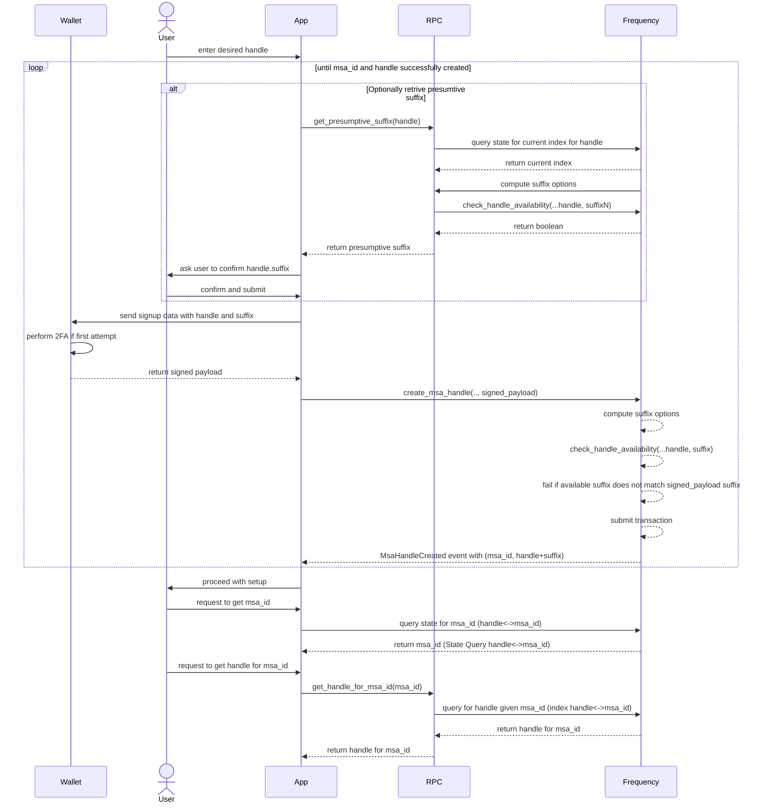

# Frequency  Handles

## Context and Scope

The Frequency blockchain aims to provide a mechanism to register and retrieve user handles on chain to make it easier to use MSA Ids.
To achieve this, we propose the creation of a user handle ```registry``` system on Frequency chain, coupled with ```MessageSourceAccount```, that allows users to choose a handle for their MSA Ids.  The Handle system would then append an available numeric suffix to the chosen user handle, separated by a delimiter[.], to make it unique and store the mapping of the handle to the MSA Id in the registry.
The user handle system will also enforce guidelines to ensure that handles are user-friendly and easy to remember, as well as prevent misuse and abuse.

The goal of this proposal is to enable users to create unique handles on the Frequency blockchain using a registry, making it more accessible for users to engage with the network.

## Assumptions

* ```MessageSourceAccount``` exists for a user to create a handle.
* It is optional for a user to create a handle.
* Handles are unique and have a 1:1 mapping with ```MessageSourceAccount```.
* Handles have `n`digits of suffix and is defined by a window of suffixes as `HandleSuffixMin` to `HandleSuffixMax`.
* Handles should support capacity based transactions.
* Retirement should be feeless.

## Requirements

The high level requirements for user handles are:

* Handles can be claimed as long as they are in allowed characters ranges configured on chain.
* Suffixes are randomly constrained and selected within a range configured on chain.
* Suffixes window must be runtime configurable.
* Ensure handles and suffixes are unique and non-conflicting.
* Make the system resistant to namespace exhaustion, homoglyphs and race conditions.
* Make the system easy to use and integrate with existing UI and wallet systems.
* Reduce the likelihood of abuse and misuse of the system for example secondary market trading of handles.

### Handles Terminology

* **Base Handle**: A base handle is a string of characters chosen by the user of Frequency.  The base handle is the part of the handle that is not suffixed.
* **Canonical Base**: A canonical base is a reduced/translated version of a base handle that is used to identify a user on the Frequency blockchain.
* **Suffix**: A suffix is a numeric value that is appended to a base handle to make it unique.  The suffix is randomly constrained and selected within a range configured on chain.
* **Delimiter**: A delimiter is a character that is used to separate the base handle and suffix.  The delimiter is a period (.) by default.
* **Display Handle**: A display handle is formed by concatenating the base handle and suffix with the delimiter.  The display handle is the handle that is displayed to the user.
  
### Handle Guidelines

* User handles must be unique and each msa can only be mapped to one handle.
* User handles must be between 3 and 20 characters (32b limit) long.
* User handles must only contain characters that are URL safe
* User handles cannot contain the following substrings (or homoglyphs): @, #, :, ., ``` (this is just a suggestion, we can add more if needed)
* User handles cannot match any in a blocklist. e.g. (@admin, @everyone, @all) and others (this is just a suggestion, we can add more if needed)
* Suffixes are numeric and contain digits without any leading zeros.
* Suffixes are `u16` limited to a range set as runtime `Config` parameters.
* Suffix will be randomly constrained.
* Homoglyph versions of handles should still resolve to the same ```msa_id``` (e.g. ```user.1234``` and ```u$er.1234``` should resolve to the same ```msa_id```).
* `Display Handle` is the handle that is displayed to the user and must be unique.

## Proposal

Handles```registry``` on Frequency chain.

### General Steps

* Create a randomly shuffled array of numeric suffixes.
* For each base handle requested, a storage map will be created with a randomly generated start index (in to the shuffled array) and a current index.  The current index will be incremented each time a new suffix is requested.
* When the current index reaches the start index, all suffixes are exhausted and an error is returned.
* Alternativelty: Query the chain to check which values are possi available, check if the handle with the suffix is available before claiming a handle.
* Chain validates the handle and suffix and maps the handle to the ```msa_id```.
* Chain maintains a reverse mapping from handle to msa for offchain use.
* Chain provides a set of rpcs to query msa for a given `DisplayHandle` and vice versa.
* Chain providers an rpc to get presumptive suffix for a given base handle.

### Handle replay attack

To prevent replay attacks, the chain will require a mortality period for handles. This can be included in signed payload from user as a `expiration` field. The chain will check if the `expiration` is greater than the current block number. If not, the transaction will fail.  

### Handling Race Conditions

There is an exceedingly small chance that two users may attempt to claim the same handle and suffix combination within the same block. In such cases, the transaction will succeed as the distribution of suffixes by chain is random as well as on a first come basis.

## Sequence Diagram



## Storage

* **HandleSuffixMin**: This storage value (```u32```) will keep track of the minimum suffix value allowed for a given handle.
* **HandleSuffixMax**: This storage value (```u32```) will keep track of the maximum suffix value allowed for a given handle.
* **MSAIdToDisplayName**: This storage will map MSAIds to their corresponding user display handles.
* **CanonicalBaseHandleAndSuffixToMSAId**: This storage will map user handles to their corresponding MSAIds.
* **CanonicalBaseHandleToSuffixIndex**: This storage will map canonical version of handles to their corresponding suffix index. This is used to keep track of the current suffix index for a given canonical base.

## Required Extrinsics

### Primitives

``` rust

ClaimHandlePayload {
    base_handle: &[u8],
    expiration: u32,
}
```

### Claim handle

 As a network, Frequency should allow users to choose their own handle, while chain will generate a random numeric suffix within the range of suffixes allowed. The display handle will be the base handle with the suffix.

Input

* origin - must be a signed origin
* msa_owner_key - the public key of the MSA owner. This is used to verify the signature and resolve the MSA ID.
* proof - the multi-signature proof for the payload.
* payload - the payload containing the information needed to claim the handle, including `base_handle` and `expiration` as a `ClaimHandlePayload`.

Output

* Event - `HandleCreated` with the MSA ID and the handle.
* Errors -
  * `HandleAlreadyExists` if the handle already exists.
  * `InvalidHandleByteLength` if the base handle size exceeds the maximum allowed size.
  * `InvalidMessageSourceAccount` if the caller does not have a valid MSA ID.
  * `InvalidSignature` if the payload signature verification fails.
  * `InvalidSuffix` if the suffix is invalid.
  * `ProofNotValid` if the proof is not valid as of the current block.
  * `ProofHasExpired` if the proof has expired.

Validation requirements

* Handle must follow handle guidelines.
* Handle must be unique.
* Handle must be available.
* Suffix must be available.
* Suffix must be in the range of the handle.
* MSA ID must exist. Signing keys must resolve to MSA ID.
* Payload signature must be valid.
* Base handle size must not exceed the maximum allowed size.

Signature requirements

The extrinsic must be signed by the MSA owner's private key. The signature must be verified on-chain to ensure that the user is the owner of the handle. Without the possibility of a replay attack, the chain can verify that the user is the owner of the handle and no special mechanism to handle signature reuse is required.

### Retire handle

As a network, Frequency should allow users to retire their handles. This extrinsic will allow users to retire their handles.

Note: As of this implementation

* Retiring display handle will not be available for reuse, given the unique nature of the display handle with the suffix.

Input

* origin - must be a signed origin and must be the owner of the handle.

Output

* Event - `HandleRetired` with the MSA ID and the handle.
* Errors -
  * `InvalidMessageSourceAccount` if the caller does not have a valid MSA ID.
  * `MSAHandleDoesNotExist` if the handle does not exist.
  * `HandleWithinMortalityPeriod` if an early retirement on a handle is requested

**Note:**

* Claim handle should be Capacity possible transactions.
* Retire handle should be ```Pays::No```.
* An MSA cannot be retired (```retire_msa``` call) if a claimed user handle has not also been retired first.

## RPCs

* RPC to get the display handle (base handle + suffix) given a ```msa_id```.
* RPC to get the ```msa_id``` given a display handle.
* RPC to get a set of available suffixes given a base handle and count (limited to 100 and defaulted to 1)

## Risks

* **Risk**: The handle feature may not be used by users.
  * **Mitigation**: The handle feature is not a core feature of the protocol. It is an optional feature that users can choose to use or not. If the feature is not used by users, it will not affect the protocol.
* **Risk**: Homoglpyhs.
  * **Mitigation**: Frequency handles will use a PRNG to generate suffixes. This will prevent homoglyph attacks. However, a utility to check for homoglyphs will be provided to help users avoid homoglyphs.
* **Risk**: Unavailability of desired suffixes.
  * **Mitigation**: The handle feature will provide a utility to check for available suffixes. This will allow users to check for available suffixes before attempting to create a new MSA.
* **Risk**:  Claims on retired handles.
  * **Mitigation**: Frequency would use a retirement period to prevent claims on retired handles. The retirement period would be set to some block number in future. This would allow users to claim their handles after the retirement period has ended.
* **Risk**:  Handle merging.
  * **Mitigation**: To be determined. This will be decided based on implementation requirements.

## Additional Notes

* **Suffix generation**: The suffix generation algorithm will be based on a lazy sequence of suffixes. The algorithm will take a seed and generate a sequence of suffixes. The sequence will be generated lazily, i.e. the algorithm will generate a new suffix only when the previous suffix has been used. This will prevent the generation of a large number of suffixes that may not be used. [An Example of Fisher Yates, and Lazy Sequence Shuffling](https://github.com/Liberty30/magic-rs)

* **Suffix Range (min, max)**: Ideally we should enforce suffixes window to be of a minimum size, say 10k. This will prevent the generation of a large number of suffixes that may not be used, while keeping the performance in acceptable limits.
