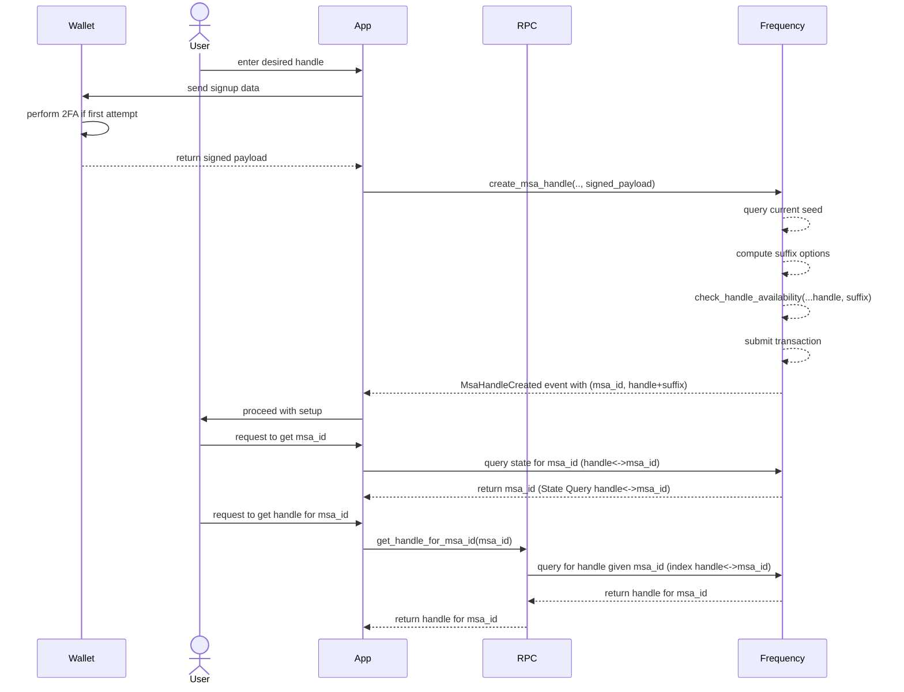
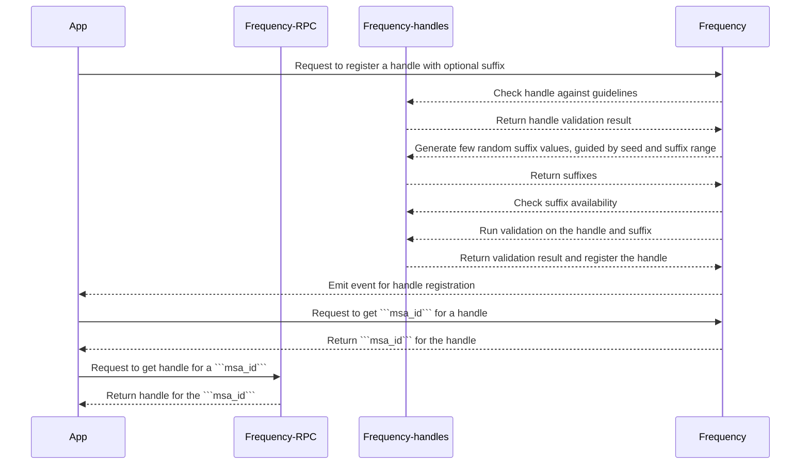

# Frequency User Handles Registry

## Context and Scope

The Frequency blockchain aims to provide a mechanism to register and retrieve user handles on chain to make it easier to use MSA Ids.
To achieve this, we propose the creation of a user handle ```registry``` system on Frequency chain, coupled with ```MessageSourceAccount```, that allows users to choose a handle and select a suffix from a set of options allowed by the chain that together are unique.
The user handle system will also enforce guidelines to ensure that handles are user-friendly and easy to remember, as well as prevent misuse and abuse.

The goal of this proposal is to enable users to create unique handles on the Frequency blockchain using a registry, making it more accessible for users to engage with the network.

## Assumptions

* ```MessageSourceAccount``` exists for a user to create a handle.
* It is optional for a user to create a handle.
* Handles are unique and have a 1:1 mapping with ```MessageSourceAccount```.
* Governance will define the range of suffixes allowed for a given handle.
* Governance will define the time period a handle must be retired before it can be reused.
* The handle create/change/(and retire, if its not feeless) supports capacity based transactions.

## Requirements

The high level requirements for user handles are:

* Support user ability to choose any valid handle and select a suffix from a set of options allowed by the chain.
* Ensure handles and suffixes are unique and non-conflicting.
* Make the system resistant to namespace exhaustion, homoglyphs and race conditions.
* Make the system easy to use and integrate with existing UI and wallet systems.
* Reduce the likelihood of abuse and misuse of the system for example secondary market trading of handles.

## Proposal

User handle ```registry``` on Frequency chain.

### Handle Guidelines

* User handles must be unique and each msa can only be mapped to one handle.
* User handles must be between 2 and 32 characters (32b limit) long.
* User handles cannot contain the following substrings (or homoglyphs): @, #, :, ., ```
* User handles cannot be (@admin, @everyone, @all) *blocklist of handles we reserve
* Suffixes are u32 limited to a range defined by governance
* Suffix will be randomly constrained.
* Homoglyph versions of handles should still resolve to the same MSA.
* After a handle is released, it cannot be reused by a time block set by governance.

### General Steps

* Query the chain for the current seed value.
* Hash the seed with the user desired handle base.
* Apply the resulting value as the seed to the specified PRNG.
* Generate the next 10/20 ```u32``` values from the PRNG these are the possible suffixes within the range of suffixes allowed by the chain.
* Query the chain to check which values are available, check if the handle with the suffix is available.
* Choose an available value and attempt to claim it by submitting the full handle with the suffix to the chain.
* Chain validates the handle and suffix and maps the handle to the ```msa_id```.
* Chain maintains a reverse mapping from handle to msa for offchain use.

### Chain Steps

* Every 100 blocks (e.g., when block_number % 100 == 1), update the current seed by taking the Merkle root of the previous block. Keep the current and one previous seed so that two seeds, s0 and s1, are part of the chain state at any given time.
* Provide an RPC to get the current seed.
* Provide an RPC to get the suffix options for a given handle.
* When a user submits a handle, check the numeric suffix for availability and that it honors range defined for suffix window.
* Store ```msa_id``` to ```handle``` mapping and ```handle``` to ```msa_id``` mapping.

### Handling Race Conditions

There is an exceedingly small chance that two users may attempt to claim the same handle and suffix combination within the same block. In such cases, the transaction will fail to create the MSA, and the app will receive a failure for the transaction rather than the expected MsaHandleCreated event.

## Sequence Diagram



## Storage

* **HandleSuffixMin**: This storage value (```u32``) will keep track of the minimum suffix value allowed for a given handle.
* **HandleSuffixMax**: This storage value (```u32``) will keep track of the maximum suffix value allowed for a given handle.
* **HandleRetirementPeriod**: This storage value (```u32``) will keep track of the number of blocks a handle must be retired before it can be reused.
* **MSAIdToUserHandle**: This storage will map MSAIds to their corresponding user handles.
* **UserHandlesToMSAId**: This storage will map user handles to their corresponding MSAIds.
* **RetiredHandles**: This storage will keep track of all retired handles and the block number at which they were retired. This probably is a spike to run few ideas on how to implement this.
* **Seed (current and previous)**: This storage values (```tuple (s0, s1)```) will keep track of the current and previous seed values.

### **Notes:**

* The handle being mapped to MSA ID is the handle with the suffix i.e. full handle.
* Side note. While this is correct, we would want to store the key of **UserHandlesToMSAId** as either the reduced handle (aka post homoglyph replacement) or the hash of the reduced handle.

* Idea around **RetiredHandles**: We could store this in the UserHandlesToMSAId data as "retired" with the block number it retired on. (That way it is merely waiting for current_block > (retire_block + HandleRetirementPeriod))

## Required Extrinsics

### Primitives

``` rust

MsaHandlePayload {
    handle: &[u8],
    suffix: Option<u32>,
}
```

### Create user handle with chosen handle and optional suffix

 As a network, Frequency should allow users to choose their own handle and suffix. This extrinsic will allow users to create a handle with a chosen suffix. If the suffix is not provided, the chain will generate a random suffix within the range of suffixes allowed by the chain.

``` rust
Input

* origin - must be a signed origin
* owner_key - the public key of the owner. This is used to verify the signature and resolve the MSA ID.
* proof - the proof of ownership of the handle, ```MsaHandlePayload``` signed by the owner's private key

Output
* Event - `MsaHandleCreated` with the MSA ID and the handle

* Errors - 
    * `HandleAlreadyExists` if the handle already exists
    * `InvalidMsaHandle` if the handle is invalid
    * `Unauthorized` if the signature is invalid
    * `InvalidSuffix` if the suffix is invalid

Validation requirements
* handle must follow handle guidelines.
* suffix must be in the range of the handle.
* handle must be unique.
* handle must be available.
* suffix must be available.
* MSA ID must exist. Signing keys must resolve to MSA ID.

Signature requirements

The extrinsic must be signed by the owner's private key. The signature must be verified on-chain to ensure that the user is the owner of the private key.
```

### Retire user handle

As a network, Frequency should allow users to retire their handles. This extrinsic will allow users to retire their handles. Retired handles will be available for reuse after a time period set by governance.

``` rust
Input

* origin - must be a signed origin
* owner_key - the public key of the owner. This is used to verify the signature and resolve the MSA ID.
* proof_of_ownership - the proof of ownership of the handle to be retired, ```MsaHandlePayload``` signed by the owner's private key

Output

* Event - `MsaHandleRetired` with the handle

* Errors - 
    * `HandleDoesNotExist` if the handle does not exist
    * `Unauthorized` if the signature is invalid

Validation requirements
* MSA ID must exist. Signing keys must resolve to MSA ID.
* handle must exist and be owned by the MSA ID.

Signature requirements

The extrinsic must be signed by the owner's private key. The signature must be verified on-chain to ensure that the user is the owner of the private key.
```

**Note:**

* Create, and change (and retire depending on if it is Pays::No) should be Capacity possible transactions.
* If retiring a ```Pays::No transaction```? then, we could skip both owner_key and proof_of_ownership.
* If retiring an MSA (```retire_msa``` call), Frequency should also retire the handle associated with the MSA.

### Change handle

As a network, Frequency should allow users to change their handles. This extrinsic will allow users to change their handles. Retired handles will be available for reuse after a time pe>riod set by governance.

``` rust
Input
* origin - must be a signed origin
* owner_key - the public key of the owner. This is used to verify the signature and resolve the MSA ID.
* proof_of_new_ownership - the proof of ownership of the new handle, ```MsaHandlePayload``` signed by the owner's private key

Output
* Event - `MsaHandleChanged` with the old handle and the new handle
* Errors - 
    * `HandleDoesNotExist` if the handle does not exist
    * `Unauthorized` if the signature(s) is invalid
    * `InvalidMsaHandle` if the handle is invalid

Validation requirements
* MSA ID must exist. Signing keys must resolve to MSA ID.
* old handle must exist and be owned by the MSA ID.
* new handle must follow handle guidelines.
* new handle must be unique.
* new handle must be available.
* new suffix must be available.
* new suffix must be in the range of the handle.

Signature requirements

The extrinsic must be signed by the user private key. The signature must be verified on-chain to ensure that the user is the owner of the private key. The signature must also include the old handle and the new handle to prevent unauthorized handle changes.
```

**Note** :

* Change handle should also retire the old handle and suffix.
* These are possible extrinsics and inputs required for the handle feature. The exact extrinsics and inputs may change based on the implementation.

## Governance

### Governance to alter min max range

As a network, Frequency should allow governance to alter the min and max range for suffixes. This extrinsic will allow governance to alter the min and max range for suffixes.

``` rust
Input

* Min and Max range for suffix (u32) - the minimum and maximum values for the suffix range that users can choose from

Output

* Event - `HandleSettingsChanged` with the min and max range and the handle merging setting

```

### Governance to alter handle retirement period

As a network, Frequency should allow governance to alter the handle retirement period. This extrinsic will allow governance to alter the handle retirement period.

``` rust
Input

* Handle retirement period (u32) - the number of blocks after which a retired handle will be available for reuse

Output

* Event - `HandleExpiryPeriodSet` with the handle retirement period

```

## RPCs

* RPC to get the full handle (handle + suffix) given a ```msa_id```.
* RPC to get the current seed (more of a chain utility for general use).
* RPC to get a set of available suffixes given a handle (Not important for v1, however nice to have)

## Crate design overview for Frequency-handles

We propose creating a new crate, Frequency-handles, that will provide the following functionality:

### Translation

Given a user handle and a seed, the crate will provide a function that will generate a suffix for the handle. This function will be used to generate a suffix for a user handle when creating a new handle. Typical operations will be:

* Generate a suffix for a user handle using the current seed and suffix range.
* Create a PRNG helper function that takes a seed and generates a sequence of suffixes.

### Verification

The crate will provide a verification function that takes a user handle and a suffix and verifies that the handle is valid and the suffix is available. This function will be used to verify a handle and suffix when a user attempts to create a new handle or change their handle. Typical operations will be:

* Verify that the handle is valid, i.e. it follows the handle guidelines.
* Check for homoglpyhs.

### PRNG

The crate will use a PRNG (pseudo-random number generator) to generate suffix values for user handles. The PRNG will take a seed value derived from the current block's Merkle root and the user's desired handle base, and generate a sequence of 10/20 values that will be used as suffixes. These suffixes will then be checked for availability on the chain before attempting to create a new handle.

## Frequency-handles crate sequence diagram

Frequency-handles is a standalone rust crate that provide basic functionality for generating and validating handles. It is intended to be used by the Frequency chain to provide handle generation and validation functionality.



## Risks

* **Risk**: The handle feature may not be used by users.
  * **Mitigation**: The handle feature is not a core feature of the protocol. It is an optional feature that users can choose to use or not. If the feature is not used by users, it will not affect the protocol.
* **Risk**: Homoglpyhs.
  * **Mitigation**: Frequency handles will use a PRNG to generate suffixes. This will prevent homoglyph attacks. However, a utility to check for homoglyphs will be provided to help users avoid homoglyphs.
* **Risk**: Unavailability of desired suffixes.
  * **Mitigation**: The handle feature will provide a utility to check for available suffixes. This will allow users to check for available suffixes before attempting to create a new MSA.
* **Risk**:  Claims on retired handles.
  * **Mitigation**: Frequency would use a retirement period to prevent claims on retired handles. The retirement period would be set to some block number in future. This would allow users to claim their handles after the retirement period has ended.
* **Risk**:  Handle merging.
  * **Mitigation**: To be determined. This will be decided based on implementation requirements.
