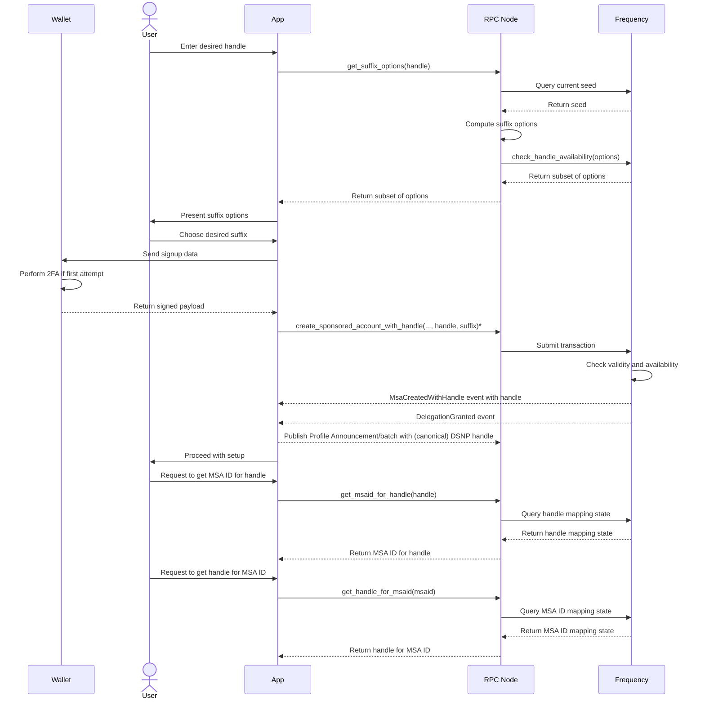
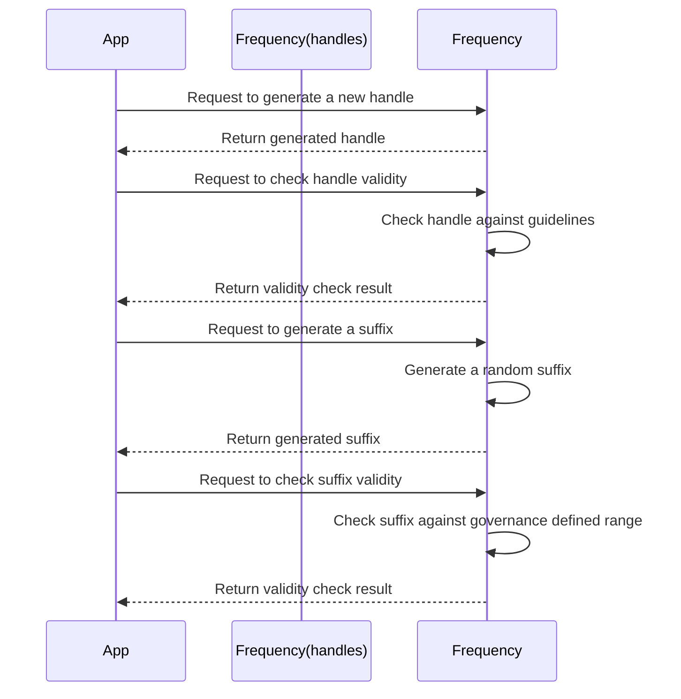

# Frequency User Handles

## Context and Scope

The Frequency blockchain aims to provide a platform for broadcasting messages without the need for users to acquire tokens. To achieve this, we propose the creation of a user handle ```registry``` system on frequency chain that allows users to choose a unique handle and select a suffix from a set of options allowed by the chain. The user handle system will also enforce guidelines to ensure that handles are user-friendly and easy to remember, as well as prevent misuse and abuse.

The goal of this proposal is to enable users to create unique handles on the Frequency blockchain via mapping, making it more accessible for users to engage with the network.

## Requirements

The requirements for user handles are:

Support user ability to choose any valid handle and select a suffix from a set of options allowed by the chain.
Ensure handles and suffixes are unique and non-conflicting.
Make the system resistant to namespace exhaustion and race conditions.
Make the system easy to use and integrate with existing UI and wallet systems.

## Proposal

User handle ```registry``` on frequency chain.

### General Steps

* Query the chain for the current seed value.
* Hash the seed with the user desired handle base.
* Apply the resulting value as the seed to the specified PRNG.
* Generate the next 10/20 ```u32``` values from the PRNG these are the possible suffixes within the range of suffixes allowed by the chain.
* Query the chain to check which values are available, check if the handle with the suffix is available.
* Choose an available value and attempt to claim it by submitting the full handle with the suffix to the chain.
* Chain check runs some validation and map the handle to the msa.
* Chain maintains a reverse mapping from handle to msa for offchain use.

### Chain Steps

* Every 100 blocks (e.g., when block_number % 100 == 1), update the current seed by taking the Merkle root of the previous block. Keep the current and one previous seed so that two seeds, s0 and s1, are part of the chain state at any given time.
* Provide an RPC to get the current seed.
* Provide an RPC to get the suffix options for a given handle.
* When a user submits a handle, check the numeric suffix for availability and that it honors range defined for suffix window.
* Store ```msa_id``` to ```handle``` mapping and ```handle``` to ```msa_id``` mapping.

### Handle Guidelines

* User handles must be unique and each msa can only be be mapped to one handle.
* User handles must be between 2 and 32 characters (32b limit) long.
* User handles cannot contain the following substrings (or homoglyphs): @, #, :, ., ```
* User handles cannot be (@admin, @everyone, @all) *blocklist of handles we reserve
* Suffixes are u32 limited to a range defined by governance
* Suffix will be randomly constrained.
* Homoglyph versions of handles should still resolve to the same MSA.
* After a handle is released, it cannot be reused by a time block set by governance.

### Handling Race Conditions

There is an exceedingly small chance that two users may attempt to claim the same handle and suffix combination within the same block. In such cases, the transaction will fail to create the MSA, and the app will receive a failure for the transaction rather than the expected MsaCreatedWithHandle event.

## Sequence Diagram



## Storage

* **HandleSuffixMin**: This storage will keep track of the minimum suffix value allowed for a given handle.
* **HandleSuffixMax**: This storage will keep track of the maximum suffix value allowed for a given handle.
* **MSAIdToUserHandle**: This storage will map MSAIds to their corresponding user handles.
* **UserHandlesToMSAId**: This storage will map user handles to their corresponding MSAIds.
* **UsedSuffixes**: This storage will keep track of all used suffixes to ensure that no two handles have the same suffix. (May not be necessary)
* **Seed (current and previous)**: This storage will keep track of the current and previous seed values.

## Required Extrinsics

## Create user handle with chosen suffix

``` rust
Input
* Origin - must be a signed origin
* Owner Msa ID - the MSA ID of the user. MSA ID must be created before calling this extrinsic.
* Handle - the desired handle chosen by the user
* Suffix - the suffix chosen by the user (must be in the range of the handle)

Output
* Event - `MsaHandleCreated` with the MSA ID and the handle

Signature requirements

The extrinsic must be signed by the user private key. The signature must be verified on-chain to ensure that the user is the owner of the private key.
```

## Retire user handle

``` rust
Input

* Origin - must be a signed origin
* Owner Msa ID - the MSA ID of the user
* Handle - the handle to be retired
* Suffix - the suffix to be retired

Output

* Event - `HandleRetired` with the handle

Signature requirements

The extrinsic must be signed by the user private key. The signature must be verified on-chain to ensure that the user is the owner of the private key.
```

## Change handle

``` rust
Input
* Origin - must be a signed origin
* Owner msa ID - the MSA ID of the user
* Old handle - the user current handle
* Old suffix - the user current suffix
* New handle - the user desired new handle
* New suffix - the user desired new suffix

Output
* Event - `MsaHandleChanged` with the old handle and the new handle

Signature requirements

The extrinsic must be signed by the user private key. The signature must be verified on-chain to ensure that the user is the owner of the private key. The signature must also include the old handle and the new handle to prevent unauthorized handle changes.

```

## Governance to alter min max range and handle merging

``` rust
Input
* Min and Max range for suffix (u32) - the minimum and maximum values for the suffix range that users can choose from

Output

* Event - `HandleSettingsChanged` with the min and max range and the handle merging setting

Signature requirements

This extrinsic must be signed by a governance authority. The signature must be verified on-chain to ensure that the governance authority has the appropriate permissions.
```

**Note** :

* Change handle should also retire the old handle and suffix.
* These are possible extrinsics and inputs required for the handle feature. The exact extrinsics and inputs may change based on the implementation.

## RPCs

* RPC to get the current seed (more of a chain utility for general use).
* RPC to get a set of available suffixes given a handle.
* RPC to get MSA from a given handle and suffix.

## Crate design overview for frequency-handles

We propose creating a new crate, frequency-handles, that will provide the following functionality:

### Translation

The crate will provide a translation function that takes a user handle and a suffix and returns the corresponding MSA ID. This function will be used to map user handles to MSAs, as well as to perform reverse lookups from MSA IDs to user handles.

### Verification

The crate will provide a verification function that takes a user handle and a suffix and checks whether the resulting MSA ID is valid according to the current seed and the chain's MSA creation rules. This function will be used to validate user handle choices before attempting to create a new MSA.

## PRNG

The crate will use a PRNG (pseudo-random number generator) to generate suffix values for user handles. The PRNG will take a seed value derived from the current block's Merkle root and the user's desired handle base, and generate a sequence of 20 values that will be used as suffixes. These suffixes will then be checked for availability on the chain before attempting to create a new MSA.

## Crate sequence diagram

Frequency-handles is a standalone rust crate that provide basic functionality for generating and validating handles. It is intended to be used by the frequency crate to provide handle generation and validation functionality.



## Risks

* **Risk**: The handle feature may not be used by users.
  * **Mitigation**: The handle feature is not a core feature of the protocol. It is an optional feature that users can choose to use or not. If the feature is not used by users, it will not affect the protocol.
* **Risk**: Homoglpyhs.
  * **Mitigation**: Frequency handles will use a PRNG to generate suffixes. This will prevent homoglyph attacks. However, a utility to check for homoglyphs will be provided to help users avoid homoglyphs.
* **Risk**: Unavailability of desired suffixes.
  * **Mitigation**: The handle feature will provide a utility to check for available suffixes. This will allow users to check for available suffixes before attempting to create a new MSA.
* **Risk**:  Claims on retired handles.
  * **Mitigation**: Frequency would use a retirement period to prevent claims on retired handles. The retirement period would be set to some block number in future. This would allow users to claim their handles after the retirement period has ended.
* **Risk**:  Handle merging.
  * **Mitigation**: To be determined. This will be decided based on implementation requirements.
