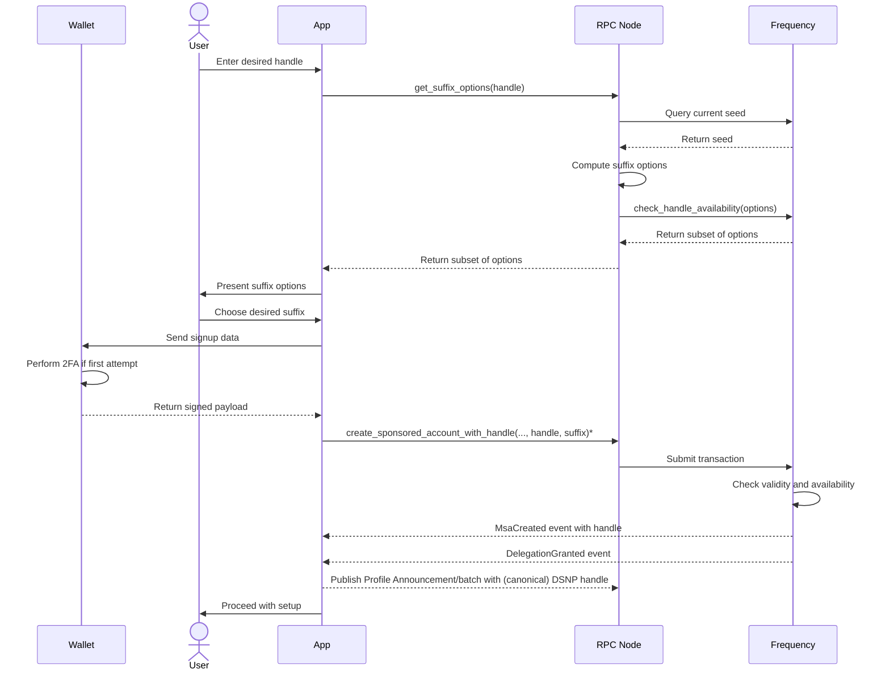
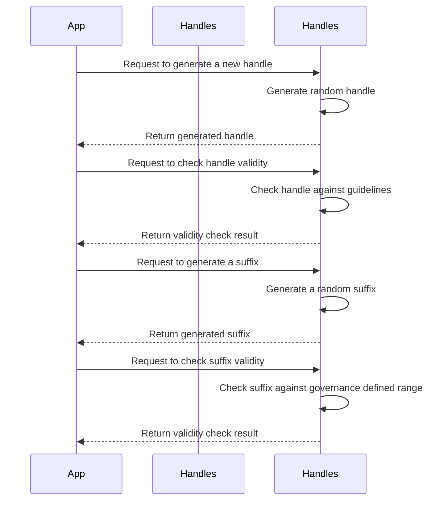

# Frequency User Handles

## Context and Scope

The Frequency blockchain aims to provide a platform for broadcasting messages without the need for users to acquire tokens. To achieve this, we propose the creation of a user handle system that allows users to choose a unique handle and select a suffix from a set of options allowed by the chain. The user handle system will also enforce guidelines to ensure that handles are user-friendly and easy to remember, as well as prevent misuse and abuse.

The goal of this proposal is to enable users to create unique handles on the Frequency blockchain via mapping, making it more accessible for users to engage with the network.

## Requirements

The requirements for user handles are:

Support user ability to choose any valid handle and select a suffix from a set of options allowed by the chain.
Ensure handles and suffixes are unique and non-conflicting.
Make the system resistant to namespace exhaustion and race conditions.
Make the system easy to use and integrate with existing UI and wallet systems.

## Proposal

### General Steps

* Query the chain for the current seed value.
* Hash the seed with the user desired handle base.
* Apply the resulting value as the seed to the specified PRNG.
* Generate the next 10 uint16 values from the PRNG.
* For each value, calculate modulo 9000, then add 1000, to get a number between 1000 and 9999.
* Generate MSAs by concatenating the suffix to the requested handle base and hashing mod 232.
* Query the chain to check which values are available.
* Choose an available value and attempt to claim it by submitting the full handle with the MSA creation RPC.

### Chain Steps

* Every 100 blocks (e.g., when block_number % 100 == 1), update the current seed by taking the Merkle root of the previous block. Keep the current and one previous seed so that two seeds, s0 and s1, are part of the chain state at any given time.
* Provide an RPC to get the current seed.
* When a user submits a handle, check that the last four characters are numeric and that they represent one of the 20 possible values for the base handle, derived by constructing the same PRNG state using s0 and s1. Also, check that the full handle hashes to the MSA as required.

### Handle Guidelines

* User handles must be unique and each msa can only be be mapped to one handle.
* User handles must be between 2 and 32 characters (32b limit) long.
* User handles cannot contain the following substrings (or homoglyphs): @, #, :, ., ```
* User handles cannot be (@admin, @everyone, @all) *blocklist of handles we reserve
* Suffixes are u32 limited to a range defined by governance
* Suffix will be randomly constrained.
* Homoglyph versions of handles should still resolve to the same MSA.
* After a handle is released, it cannot be reused by a time block set by governance.

### Handling Race Conditions

There is an exceedingly small chance that two users may attempt to claim the same handle and suffix combination within the same block. In such cases, the transaction will fail to create the MSA, and the app will receive a failure for the transaction rather than the expected MsaCreated event.

## Sequence Diagram



## Possible Storage Maps

* **MSAIdToUserHandle**: This storage will map MSAIds to their corresponding user handles.
* **UserHandlesToMSAId**: This storage will map user handles to their corresponding MSAIds.
* **UsedSuffixes**: This storage will keep track of all used suffixes to ensure that no two handles have the same suffix. (May not be necessary)
* **Seed (current and previous)**: This storage will keep track of the current and previous seed values.

## Required Extrinsics

## Create user handle with signature

``` rust
Input
* Owner Msa ID - the MSA ID of the user
* Handle - the desired handle chosen by the user
* Signature - the user signature on the handle

Output
* Event - `MsaCreatedWithHandle` with the MSA ID and the handle

Signature requirements

The extrinsic must be signed by the user private key. The signature must be verified on-chain to ensure that the user is the owner of the private key.
```

## Retire user handle

``` rust
Input

* Handle - the handle to be retired
* Signature - the user signature on the handle

Output

* Event - `HandleRetired` with the handle

Signature requirements

The extrinsic must be signed by the user private key. The signature must be verified on-chain to ensure that the user is the owner of the private key.
```

## Change handle

``` rust
Input
* Owner Msa ID - the MSA ID of the user
* Old handle - the user current handle
* New handle - the user desired new handle
* Signature - the user signature on the old handle and new handle

Output
* Event - `HandleChanged` with the old handle and the new handle

Signature requirements

The extrinsic must be signed by the user private key. The signature must be verified on-chain to ensure that the user is the owner of the private key. The signature must also include the old handle and the new handle to prevent unauthorized handle changes.
```

## Governance to alter min max range and handle merging

``` rust
Input
* Min and Max range for suffix (u32) - the minimum and maximum values for the suffix range that users can choose from

Output

* Event - `HandleSettingsChanged` with the min and max range and the handle merging setting

Signature requirements

This extrinsic must be signed by a governance authority. The signature must be verified on-chain to ensure that the governance authority has the appropriate permissions.
```

## RPCs

* RPC to get the current seed (more of a chain utility for general use).
* RPC to get a set of available suffixes given a handle.
* RPC to get MSA from a given handle and suffix.

## Crate design overview for freqency-handles

We propose creating a new crate, frequency-user-handle, that will provide the following functionality:

### Translation

The crate will provide a translation function that takes a user handle and a suffix and returns the corresponding MSA ID. This function will be used to map user handles to MSAs, as well as to perform reverse lookups from MSA IDs to user handles.

### Verification

The crate will provide a verification function that takes a user handle and a suffix and checks whether the resulting MSA ID is valid according to the current seed and the chain's MSA creation rules. This function will be used to validate user handle choices before attempting to create a new MSA.

## PRNG

The crate will use a PRNG (pseudo-random number generator) to generate suffix values for user handles. The PRNG will take a seed value derived from the current block's Merkle root and the user's desired handle base, and generate a sequence of 20 values that will be used as suffixes. These suffixes will then be checked for availability on the chain before attempting to create a new MSA.

## Crate sequence diagram

Frequency-handles is a standalone rust crate that provide basic functionality for generating and validating handles. It is intended to be used by the frequency crate to provide handle generation and validation functionality.


